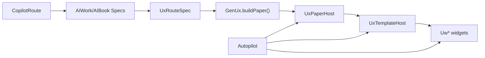
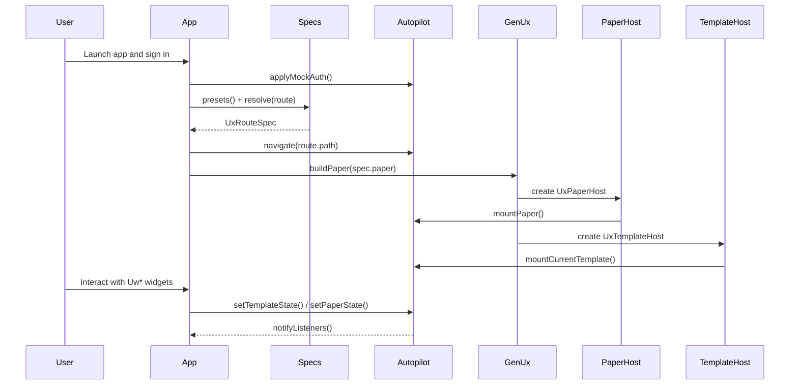
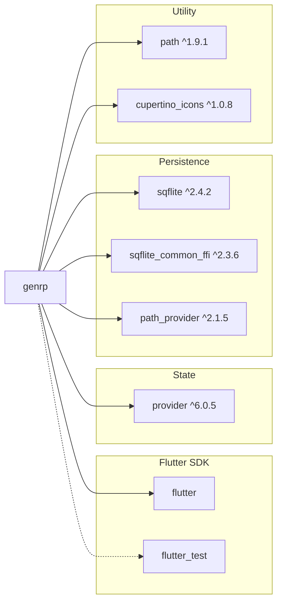

# GenRP — Deep Project Analysis

> **Project:** `genrp` — Generative Resource Planner  
> **Platform:** Flutter (macOS, Linux, Windows, Android, iOS)  
> **SDK:** Dart ≥3.11.0  
> **Analysis Date:** 2026-03-21  

---

## 1. Executive Summary

GenRP is a **Flutter monolith** containing **four distinct applications** inside a single codebase, unified by a shared `core` library:

| App | Role | Maturity |
|---|---|---|
| **AIWork** | Client/workflow CRUD surface | Ready to run from spec data |
| **AIBook** | Client/runtime reader surface | Ready to run from spec data |
| **AIStudio** | UX/spec authoring surface | Shared `AdminHome` shell, halfway restored |
| **AICodex** | Sensitive data-model authoring + schema-application surface | Shared `AdminHome` shell, halfway restored |

The apps share a common orchestration layer (`Autopilot`), route/spec metadata, shared UX primitives, and optional local DB scaffolding under `core/db`. `AIWork` and `AIBook` remain spec-driven through `GenUx` in `lib/core/gen/genux.dart`, currently using local preset specs as the ready-state source, while `AIStudio` and `AICodex` now use dedicated hard-coded authoring shells seeded from app-owned section data and shared `Uw*` components from `lib/core/ux/uwidget/`. The repo also has shared DB contract/admin/client scaffolding for PostgreSQL, SQLite, and remote action payloads, but those transport and persistence layers are not yet the live ready-state source for the current authoring shells. The client-facing end goal is still server-spec-driven UI once the bootstrap and transport path is wired. The architecture is intentionally lean, numeric-first, and optimized around a small set of reusable UX primitives.

The current UI direction is to keep `AIStudio` and `AICodex` converged on one shared admin shell in `lib/core/gen/adminhome.dart`. The current shell is a halfway-restored authoring/admin structure: a fixed left explorer panel, a detail area with mode-based one-panel or two-panel layouts, shared admin state in `lib/core/gen/admin_state.dart`, and a shared expandable explorer in `lib/core/gen/uexplorer.dart`. The shell is intentionally narrow and practical: layout, state slots, explorer behavior, and chrome only. The remaining half of the work is real panel content, DB-backed loading, and app-specific actions.

The current visual baseline is a shared **Material 3 theme** owned by `UxTheme` in `lib/core/theme/theme.dart`, with centralized typography and chrome sizing. The main entry plus AIWork, AIBook, AIStudio, and AICodex share the same toolbar-height and bottom-status sizing rules, and scaffold-level FABs have been removed in favor of in-panel or header actions. Each app currently owns a dedicated login screen and a dedicated loading screen before the ready-state route UI is shown.

The data-model layer is the foundation of the whole system because it is the actual schema side: the sitting table/function definitions from which runtime and UX layers are derived. That layer is intentionally single origin, single source of truth, and single user under `AICodex`. On authoring surfaces, new schema-side rows should begin as drafts with `i = 0`; save/edit then decides insert vs update and allocates `max(i) + 1` only when the draft is first persisted.

### 1.1 Architecture Phase Change

One of the most important project changes is that GenRP is no longer trying to
carry several overlapping architecture identities at once.

In earlier phases, the docs and experiments referred to many adjacent layers:

- core engine
- runtime
- renderer
- builder
- generator
- router / body-router
- session wrapper
- layout helper / layout engine

Those labels came from real exploration work, but they also describe a period
where responsibilities were not yet fully collapsed. Different notes could make
the system sound like a runtime stack, a generator stack, a renderer stack, or
an app-shell/session stack depending on which document was read first.

The current working tree is much cleaner and should now be read through one
active runtime path only:

- `Autopilot` is the single orchestration layer.
- `GenUx` is the current spec-to-widget renderer for spec-driven apps.
- `core/ux` owns the shared UI contracts and primitives through `mixins.dart`, `paper/`, `template/`, and `uwidget/`.
- `AIWork` and `AIBook` stay on the spec-driven path.
- `AIStudio` and `AICodex` use dedicated hard-coded authoring shells, but they reuse the same shared UX primitives instead of introducing a competing runtime.

This means older references to `AutopilotGo`, body-router/template-runtime
pipelines, extra session wrappers, or generator-heavy runtime ownership should
be interpreted as historical experiment context unless a future change
explicitly reintroduces them.

### 1.2 Default Entry Point Change

As of this snapshot, `main.dart` boots **AICodex** by default (previously AIWork). Dedicated secondary entry points exist for `main_aistudio.dart` and `main_aicodex.dart`, both with `autoSignIn: true` for convenience.

---

## 2. Architecture Overview

```mermaid
graph TB
    subgraph "Entry Points"
        MAIN["main.dart<br/>AICodex default entry"]
        MAINSTUDIO["main_aistudio.dart"]
        MAINCODEX["main_aicodex.dart"]
    end

    subgraph "Applications"
        AIWORK["AIWork<br/>Client CRUD"]
        AIBOOK["AIBook<br/>Runtime Client"]
        AICODEX["AICodex<br/>Data-model Authoring"]
        AISTUDIO["AIStudio<br/>UX/Spec Authoring"]
    end

    subgraph "App Specs"
        WSP["AIWorkSpecs"]
        BSP["AIBookSpecs"]
        CSP["AICodex App-owned Surfaces"]
        SSP["AIStudio App-owned Surfaces"]
        URS["UxRouteSpec / UxPaperSpec / UxTemplateSpec"]
    end

    subgraph "Core Orchestration"
        AP["Autopilot"]
        CD["CopilotData"]
        CU["CopilotUX"]
        DS["DataSet"]
        SS["StateSet"]
        AS["ActionSet"]
    end

    subgraph "Admin Shell"
        AH["AdminHome<br/>core/gen/adminhome.dart"]
        AST["AdminState<br/>core/gen/admin_state.dart"]
        ES["ExplorerState<br/>core/gen/explorer_state.dart"]
        UE["UExplorer<br/>core/gen/uexplorer.dart"]
        GA["GenAuthoringPanels<br/>core/gen/genauthoring.dart"]
    end

    subgraph "UX Runtime"
        GX["GenUx<br/>core/gen/genux.dart"]
        PH["Paper + UxPaperHost"]
        TH["Template + UxTemplateHost"]
        VW["Uw* widgets"]
        REG["mixins.dart<br/>UxRegister + Ux / Paper / Template / Uwidget"]
    end

    subgraph "Schema Models"
        US["uschema specs"]
        BS["bschema + base models"]
    end

    subgraph "Data / Transport"
        X["X / Xi / Xia / Xiad / Xiade<br/>(Base Transport)"]
        DTP["DataType / TypeMapper"]
        CONV["Converter"]
    end

    subgraph "Persistence"
        SQL["SqliteStore"]
        DBC["DB Contract + Clients"]
    end

    MAIN --> AICODEX
    MAINSTUDIO --> AISTUDIO
    MAINCODEX --> AICODEX

    AIWORK --> WSP
    AIBOOK --> BSP
    AICODEX --> AH
    AISTUDIO --> AH

    AH --> AST
    AH --> ES
    AH --> UE
    AH --> GA

    WSP --> URS
    BSP --> URS

    URS --> GX
    GX --> PH
    GX --> TH
    GX --> VW
    REG --> GX

    AIWORK --> AP
    AIBOOK --> AP
    AICODEX --> AP
    AISTUDIO --> AP

    AP --> CD
    AP --> CU
    AP --> DS
    AP --> SS
    AP --> AS
    AP --> PH
    AP --> TH
    AP --> VW
    AP --> X

    US --> URS
    BS --> AICODEX

    DBC --> SQL
```



---

## 3. Codebase Statistics

| Metric | Value |
|---|---|
| **Source files** (`lib/`) | 83 Dart files |
| **Source LOC** (`lib/`) | ~8,509 lines |
| **Test files** (`test/`) | 0 Dart files in the current working tree |
| **Test LOC** (`test/`) | 0 |
| **Asset JSON files** | 2 files |
| **Asset data dir** | `assets/data/` (empty, reserved) |
| **Doc files** (`docs/`) | 12 markdown files |
| **Dependencies** | flutter, cupertino_icons, path, path_provider, provider, sqflite, sqflite_common_ffi |
| **Dev Dependencies** | flutter_test, flutter_lints |
| **Analyzer status** | `flutter analyze` passes clean on 2026-03-21 |

### Per-Directory Breakdown

| Directory | Files | LOC |
|---|---|---|
| `lib/app/aiwork/` | 2 | 482 |
| `lib/app/aibook/` | 2 | 469 |
| `lib/app/aicodex/` | 1 | 45 |
| `lib/app/aistudio/` | 1 | 34 |
| `lib/core/agent/` | 7 | 598 |
| `lib/core/base/` | 7 | 618 |
| `lib/core/db/` | 8 | 902 |
| `lib/core/gen/` | 6 | 1,129 |
| `lib/core/model/` | 16 | 1,057 |
| `lib/core/theme/` | 1 | 297 |
| `lib/core/ux/` | 28 | 2,819 |
| Root entry files | 4 | 59 |

---

## 4. Directory Structure

```
genrp/
├── lib/
│   ├── main.dart                         # Default app entry (boots AICodex)
│   ├── main_aistudio.dart               # AIStudio dedicated entry (autoSignIn)
│   ├── main_aicodex.dart                # AICodex dedicated entry (autoSignIn)
│   ├── meta.dart                         # Static version flags
│   ├── app/
│   │   ├── aiwork/
│   │   │   ├── aiwork.dart               # AIWork MaterialApp + stage flow
│   │   │   └── aiwork_specs.dart         # AIWork preset routes and papers
│   │   ├── aibook/
│   │   │   ├── aibook.dart               # AIBook MaterialApp + stage flow
│   │   │   └── aibook_specs.dart         # AIBook preset routes and papers
│   │   ├── aicodex/
│   │   │   └── aicodex.dart              # AICodex MaterialApp + AdminHome shell
│   │   └── aistudio/
│   │       └── aistudio.dart             # AIStudio MaterialApp + AdminHome shell
│   ├── core/
│   │   ├── agent/
│   │   │   ├── action_set.dart           # Action registry + dispatch helpers
│   │   │   ├── autopilot.dart            # Orchestrator + scoped state/auth/navigation
│   │   │   ├── copilot_data.dart         # Data facade over DataSet
│   │   │   ├── copilot_route.dart        # Route parsing + path model
│   │   │   ├── copilot_ux.dart           # UX facade over StateSet
│   │   │   ├── data_set.dart             # Key/value data store
│   │   │   └── state_set.dart            # Key/value state store (chrome/paper/template scopes)
│   │   ├── base/
│   │   │   ├── bootstrap.dart            # System bootstrap defaults, seed rows, update helpers
│   │   │   ├── converter.dart            # Tolerant type conversion helpers
│   │   │   ├── data_type.dart            # DataType registry + TypeMapper
│   │   │   ├── sysfunc.dart              # System function entrypoint seeds
│   │   │   ├── systable.dart             # System table entrypoint seeds
│   │   │   ├── systype.dart              # System target-kind entrypoint seeds
│   │   │   └── x.dart                    # Base transport classes (X hierarchy)
│   │   ├── db/
│   │   │   ├── datasource_helper.dart    # Empty placeholder
│   │   │   ├── db_contract.dart          # Shared DB specs + SQL helpers
│   │   │   ├── pgsqladmin.dart           # PostgreSQL create-db/table/function builder
│   │   │   ├── pgsqlclient.dart          # PostgreSQL foundation CRUD builder
│   │   │   ├── sqlite_store.dart         # SQLite store + SqliteCatalogRow
│   │   │   ├── sqliteadmin.dart          # SQLite create-db/table/vfun builder
│   │   │   ├── sqliteclient.dart         # SQLite foundation CRUD builder
│   │   │   └── webclient.dart            # Generic remote action/CRUD envelope builder
│   │   ├── gen/
│   │   │   ├── admin_state.dart          # Shared admin shell state (AdminMode, master1, detail1, etc.)
│   │   │   ├── adminhome.dart            # Shared admin shell for AIStudio/AICodex (539 LOC)
│   │   │   ├── explorer_state.dart       # Explorer state container (nodes, mode, selection, l/n lists)
│   │   │   ├── genauthoring.dart         # GenAuthoringPanels — responsive minor/major layout with UwTab
│   │   │   ├── genux.dart                # Spec-to-widget runtime builder
│   │   │   └── uexplorer.dart            # Expandable explorer widget for admin shells
│   │   ├── model/
│   │   │   ├── bdata/                    # 1 business data model file
│   │   │   ├── base/                     # 2 base model files
│   │   │   ├── bschema/                  # 6 schema model files
│   │   │   └── uschema/                  # 7 UX spec files + ux_specs.dart barrel
│   │   ├── theme/
│   │   │   └── theme.dart                # Shared Material 3 theme + UX chrome helpers
│   │   └── ux/
│   │       ├── mixins.dart               # Shared UxRegister / Ux / Paper / Template / Uwidget contracts
│   │       ├── ux.dart                   # UX barrel export
│   │       ├── paper/                    # 5 paper widgets
│   │       ├── template/                 # 8 template widgets
│   │       └── uwidget/                  # 13 reusable UX widgets
│   └── hub/                              # Empty directory (reserved)
├── test/                                 # No checked-in Dart tests in this working tree
├── assets/
│   ├── json/                             # 2 JSON support files
│   └── data/                             # Empty directory (reserved)
├── docs/                                 # 12 documentation files
└── pubspec.yaml
```

---

## 5. Core Subsystem Analysis

### 5.1 Orchestration Engine (`core/agent/`)

The **Autopilot** is the heart of the system — a `ChangeNotifier` that owns all runtime state:

| Component | Purpose |
|---|---|
| [autopilot.dart](lib/core/agent/autopilot.dart) | Orchestrator: field binding resolution, UX identity selection, action dispatch, mock auth |
| [copilot_data.dart](lib/core/agent/copilot_data.dart) | Thin facade over `DataSet` — reads/writes business data + publishes changes |
| [copilot_route.dart](lib/core/agent/copilot_route.dart) | Narrow app route model with `appName`, `pageSpecId`, `optionalId`, `path`, and `scopeKey` |
| [copilot_ux.dart](lib/core/agent/copilot_ux.dart) | Thin facade over `StateSet` — reads/writes UX state + publishes changes |
| [data_set.dart](lib/core/agent/data_set.dart) | `Map<String, dynamic>` store with smart `x_row.v.N` slot interception |
| [state_set.dart](lib/core/agent/state_set.dart) | Three-tier scoped state: `chrome`, `paper`, `template` — each with get/set/patch/clear |
| [action_set.dart](lib/core/agent/action_set.dart) | ID-keyed async action registry used by `Autopilot` |

**Key design decisions:**
- `CopilotData` and `CopilotUX` are **intentionally separate** (split concerns, never merge).
- Binding resolution is **dual-path**: slot-first `X.v[index]` for machine transport, fallback to string path for migration.
- Source codes: `0` = state, `1` = dataSource, `2` = dataSet.
- UX identity is scoped as `hostId + bodyId + widgetId` — used for selection highlighting in debug mode.

### 5.2 Admin Shell (`core/gen/`)

The admin shell layer has grown to **6 files / 1,129 LOC** and is the most substantial subsystem by LOC:

| Component | Purpose |
|---|---|
| [adminhome.dart](lib/core/gen/adminhome.dart) | Shared `AdminHome` widget: left explorer panel, detail area with `AdminMode`-driven layouts (`schema` / `preview` / `compare`), `_AdminModelTable` with seeded demo data, status bar |
| [admin_state.dart](lib/core/gen/admin_state.dart) | `AdminState extends ChangeNotifier` — owns `mode`, `master1`, `detail1`, `master2`, `lastItem`, `expandedItem` |
| [explorer_state.dart](lib/core/gen/explorer_state.dart) | `ExplorerState` — plain state container for explorer nodes, mode, focused master, selection tracking, and `l`/`n` list slots |
| [uexplorer.dart](lib/core/gen/uexplorer.dart) | `UExplorer` + `UExplorerNode` — tree-based explorer with master/detail modes, expand/collapse, and selection highlighting |
| [genauthoring.dart](lib/core/gen/genauthoring.dart) | `GenAuthoringPanels` — responsive minor/major panel layout with breakpoint-driven stacking and `UwTab`-based major panel |
| [genux.dart](lib/core/gen/genux.dart) | `GenUx` — spec-to-widget runtime builder for AIWork/AIBook |

**AdminHome layout:**
- Left panel: fixed `200px` width with `UExplorer`
- Detail panel: mode-driven
  - `schema` mode: single main panel with `_AdminModelTable`
  - `preview` mode: main panel + fixed `200px` right side panel
  - `compare` mode: main panel + equal-width right panel
- Status bar: `32px` height, shows current mode and app version
- `_AdminModelTable`: seeded bschema demo rows (Entity, Field, Table, Column, Function, Parameter) with appropriate columns per model type

**AICodex passes `_bschemaNodes`** (Entity, Field, Table, Column, Function, Parameter) as flat leaf nodes. **AIStudio uses the default nodes** which are grouped hierarchically (Business → Entity/Field, Database → Table/Column/Function).

### 5.3 Transport Layer (`core/base/`)

| Class | Fields | Purpose |
|---|---|---|
| `X` | `v: List<dynamic>` | Base transport with compact payload list |
| `Xi` | `i, v` | + integer ID |
| `Xia` | `i, a, v` | + active flag |
| `Xiad` | `i, a, d, v` | + date/discriminator |
| `Xiade` | `i, a, d, e, v` | + entity reference |

**X ID direction**
- `Xi.i` can use `max(i) + 1`.
- Richer variants (`Xia`, `Xiad`, `Xiade`) should use epoch-millisecond-based IDs rather than `max(i) + 1`.
- Planned formula direction is `epochMs * 10/100/1000 + suffix`, with suffix inside `0..999`.
- Keep those values within 53-bit safe integer range for web/JSON transport even if PostgreSQL stores them as `bigint`.

All implement `fromJson` / `toJson`. The `v` list is the **slot-addressable payload** — field bindings resolve to `v[slot]` by design.

**`DataType` / `TypeMapper`** provides a cross-platform type registry (Dart ↔ PostgreSQL ↔ SQLite ↔ JSON):
- Built-in types 0–11 (bool, Int32, Int53, Int64, Double, Binary, Json, Jsonb, Guid, String, Base64)
- Dynamic numeric types: ID > 99 encodes `Numeric(whole, scale)` via `id % 100` / `id ~/ 100`

**`Converter`** provides null-safe, tolerant type conversions (`toInt`, `toDouble`, `toBool`, `toStr`, `tryInt`).

### 5.4 BSchema Models (`core/model/bschema/`) and Base Models (`core/model/base/`)

The regular schema-row models now live under `core/model/bschema/`, while the special base models live under `core/model/base/`. Four of the six regular bschema models currently share the generic row shape `i, a, d, e, t, n, s` exactly. `FunctionModel` and `EntityModel` keep that shape and add `tis` for dependent table IDs, `FieldModel` adds `ci` for mapped column ID, `ParameterModel` uses `fi` for function ID.

| Field | Type | Semantics |
|---|---|---|
| `i` | `int` | ID |
| `a` | `bool` | Active flag |
| `d` | `int` | Last date/time, usually UTC epoch milliseconds; web-safe `int^53`, PostgreSQL `bigint` when persisted there |
| `e` | `int` | Last editor reference; `int4` in `base`, `bschema`, and `uschema`, where it points to `UsrModel.i` |
| `t` | `int` | Type reference |
| `n` | `String` | Readable/display name |
| `s` | `String` | System name / slug, preferably lower snake_case |

**Regular data models:** `EntityModel`, `FieldModel`, `FunctionModel`, `ParameterModel`, `TableModel`, `ColumnModel`

**Base models:** `SystemModel`, `UsrModel`

**BData models:** `UserModel`

**Physical DB naming reminder:**
- Current remembered alias direction: `s0 = usr`, `s1 = systemmodel`, `s2 = table`, `s3 = column`, `s4 = function`, `s5 = param`, `s6 = entity`, `s7 = field`
- Business tables should start with `t`. Current remembered business-table entrypoint: `t0 = UserModel`

All are immutable with `const` constructor, `fromJson`, `toJson`, `copyWith`, `==`, `hashCode`.

### 5.5 USchema Models (`core/model/uschema/`)

| File | Class | Extra Fields |
|---|---|---|
| [ux_specs.dart](lib/core/model/uschema/ux_specs.dart) | barrel export | Re-exports the active UX spec types |
| [ux_node_spec.dart](lib/core/model/uschema/ux_node_spec.dart) | `UxNodeSpec` | Shared `i`, `s`, `m`, `code`, and `id` contract |
| [ux_field_spec.dart](lib/core/model/uschema/ux_field_spec.dart) | `UxFieldSpec` | `label`, `hint`, `width` |
| [ux_view_spec.dart](lib/core/model/uschema/ux_view_spec.dart) | `UxViewSpec` | `vid`, `p`, plus packed IDs via `UxRegister` |
| [uxm_template_spec.dart](lib/core/model/uschema/uxm_template_spec.dart) | `UxTemplateSpec`, `UxCrudTemplateSpec` | Template identity plus CRUD configuration |
| [ux_paper_spec.dart](lib/core/model/uschema/ux_paper_spec.dart) | `UxPaperSpec` | `pid`, `template` |
| [ux_route_spec.dart](lib/core/model/uschema/ux_route_spec.dart) | `UxRouteSpec` | `appName`, `pageSpecId`, `title`, `subtitle`, `paper`, `optionalId` |

### 5.6 UX Rendering Pipeline (`core/ux/`)



1. **App route helpers** resolve a `CopilotRoute` into a `UxRouteSpec` (`AIWork`, `AIBook`).
2. **`GenUx`** drives the spec-based papers for `AIWork` and `AIBook`.
3. **`mixins.dart`** centralizes `UxRegister`, `Ux`, `Paper`, `Template`, `Uwidget`, `UxPaperHost`, and `UxTemplateHost`.
4. **`UxPaperHost` / `UxTemplateHost`** mount scoped paper/template state inside `Autopilot`.
5. **`Uw*` widgets** (13 total): `uwlist`, `uwgrid`, `uwdatatable`, `uwtoolbar`, `uwfrom`, `uwplist`, `uwcard`, `uwitem`, `uwempty`, `uwchoose`, `uwalert`, `uwcollection`, `uwtab`.
6. **Papers** (5): `pzero` through `pfour`.
7. **Templates** (8): `tcrud` (+ `tcrudheader`, `tcrudfooter`), `tsheet`, `treport`, `tdboard`, `twizard`, `tform`.

### 5.7 Persistence (`core/db/`)

| Component | Purpose |
|---|---|
| `db_contract.dart` | Shared specs for database, table, function, and CRUD generation |
| `pgsqladmin.dart` | PostgreSQL create-database, create-table, create-function SQL |
| `sqliteadmin.dart` | SQLite create-database, create-table, and `vfun` row/script generation |
| `pgsqlclient.dart` / `sqliteclient.dart` | Direct CRUD builders for foundation targets |
| `webclient.dart` | Generic request payload builder for remote action/function calls |
| `sqlite_store.dart` | Generic local SQLite foundation with `app_kv` and `catalog_row` tables |
| `datasource_helper.dart` | Empty placeholder |

### 5.8 Application Layer (`app/`)

#### Shared app pattern
- Each app is a minimal `MaterialApp` using `UxTheme.lightTheme()` / `UxTheme.darkTheme()`.
- `AIWork` and `AIBook` own dedicated login/loading/ready stage flows with `Autopilot`.
- `AIStudio` and `AICodex` delegate directly to `AdminHome` with app-specific `title`, `statusText`, and optional `nodes`.
- Sign-in currently goes through `Autopilot.applyMockAuth(...)` (for AIWork/AIBook).

#### App roles
- **AIWork**: client/workflow CRUD surface.
- **AIBook**: client/runtime reader and business-data consumption surface.
- **AIStudio**: UX/spec authoring surface — uses default hierarchical explorer nodes.
- **AICodex**: sensitive data-model authoring plus schema-application surface — uses flat bschema nodes (Entity, Field, Table, Column, Function, Parameter).

#### AdminHome shell modes
- **Schema**: single main panel with `_AdminModelTable`
- **Preview**: main panel + fixed `200px` right side panel
- **Compare**: main panel + equal-width right panel
- Mode is cycled via the toolbar icon button

---

## 6. Data Flow Diagram



---

## 7. Backend Transport Contract

The planned backend is a **C# ASP.NET Core Minimal Web API** with a PostgreSQL backend and a distinct local SQLite role:

| Aspect | Design |
|---|---|
| **Endpoint** | Single URL, `POST` only |
| **Request body** | `{ "a": <actionId>, "u": "<user>", "p": "<password>", "data": {...} }` |
| **Server behavior** | JSON passthrough — C# does NOT map to business objects |
| **DB behavior** | PostgreSQL owns the router function, returns JSON directly |
| **Foundation CRUD** | Direct CRUD is allowed |
| **Business CRUD** | Function-style actions only |
| **Schema authority** | Data-model layer is single origin / single source of truth / single user |
| **Edit rule** | `data.i == 0` → create, `data.i > 0` → update, `data.a = false` → treat as delete |
| **No alter table** | By design |
| **No hard delete** | By design |

> [!WARNING]
> The active app flow is still mock/demo-oriented for authentication. A real remote transport boundary is not wired yet.

---

## 8. Naming Conventions & Vocabulary

| Term | Meaning |
|---|---|
| `paper` | The route-facing UX container selected by `pid` and hosted by `UxPaperHost` |
| `template` | The workflow/content layer selected by `tid` and hosted by `UxTemplateHost` |
| `uwidget` | Ultra Widget primitive layer under `lib/core/ux/uwidget/` |
| `Ux*Spec` | Definition-side UX route/paper/template/view structures under `core/model/uschema/` |
| `GenUx` | The builder that maps `uschema` specs to concrete paper/template widgets |
| `AdminHome` | Shared admin shell for AIStudio/AICodex with explorer + mode-driven detail panels |
| `AdminState` | `ChangeNotifier` owning mode, master1/detail1/master2, lastItem, expandedItem |
| `ExplorerState` | Plain state container for `UExplorer` — nodes, mode, selection, l/n lists |
| `GenAuthoringPanels` | Responsive minor/major layout with breakpoint-driven stacking |
| `X` / `Xi` / `Xia` / `Xiad` / `Xiade` | Business-bound transport/data shapes |
| `Autopilot` | The single orchestrator — owns all binding, state, actions |
| `CopilotData` / `CopilotUX` | Separate data and UX state facades (never merge) |
| `slot` | Direct index into `X.v[]` for field binding resolution |
| `src` | Binding source: `0` = state, `1` = dataSource, `2` = dataSet |
| `i/a/d/e/t/n/s` | Common model field abbreviations |
| `draft row` | A local unsaved row with `i = 0`; first Save allocates a real id |

---

## 9. Test Coverage

The checked-in Dart test tree has been deleted in this checkout.

Current verification for this analysis:
- `flutter analyze` — passes clean on 2026-03-21.
- The four active apps have been manually tested in this snapshot.
- `flutter analyze` plus manual app runs are the active verification path.

---

## 10. Current Status & Gap Analysis

### What's Working ✅

| Capability | Status |
|---|---|
| `main.dart` direct boot into AICodex | ✅ Working |
| Three entry points (`main.dart`, `main_aistudio.dart`, `main_aicodex.dart`) | ✅ Working |
| `AIWork` / `AIBook` spec-driven rendering | ✅ Working |
| `AIStudio` / `AICodex` AdminHome shell with explorer + mode-driven detail panels | ✅ Working |
| `_AdminModelTable` with seeded demo data per model type | ✅ Working |
| `UxPaperHost` / `UxTemplateHost` scoped state mounting | ✅ Working |
| Action dispatch and template/paper state mutations through `Autopilot` | ✅ Working |
| SQLite store (shared foundation) | ✅ Working |
| Shared Material 3 theme via `UxTheme` | ✅ Working |
| Centralized toolbar/status sizing | ✅ Working |
| `uschema` barrel + current spec imports | ✅ Working |
| `flutter analyze` | ✅ Passes clean |

### Known Gaps ⚠️

| Gap | Priority | Notes |
|---|---|---|
| No checked-in automated test suite | N/A | Analyzer plus manual testing are the active checks |
| Mock/demo auth and route bootstrap | High | AIWork/AIBook rely on `applyMockAuth`; AIStudio/AICodex skip auth entirely |
| Real transport integration | High | `WebClient` scaffolding exists, but active app flows are not server-backed |
| Shared DB builders not wired into app flows | Medium | Contract/admin/client scaffolding exists, but app-level integration pending |
| AIStudio authoring data is still app-seeded | Medium | No durable save/load path yet |
| AICodex schema apply is not wired | Medium | Local SQL preview exists via `_AdminModelTable`, but no real backend apply |
| `datasource_helper.dart` is empty | Low | Reserved placeholder |
| `lib/hub/` is empty | Low | Reserved placeholder directory |
| `assets/data/` is empty | Low | Reserved placeholder directory |

---

## 11. Architectural Patterns & Principles

### Design Philosophy
1. **Performance first** — compact specs, low-overhead lookups, minimal abstraction
2. **Numeric identity** — integer IDs for action, template, widget, type, source, field references
3. **Compact transport** — base `X` with slot-addressable `v[]` list, not human-readable property maps
4. **Single orchestrator** — `Autopilot` owns everything; no competing state managers
5. **Forward-only cleanup** — remove legacy layers rather than preserving parallel runtime stacks
6. **Narrow routing** — `CopilotRoute` handles app/page selection while each route renders one paper tree
7. **Convergent shell** — AIStudio and AICodex share `AdminHome` with app-specific nodes and data

### Key Patterns
- **ChangeNotifier orchestration** — `Autopilot extends ChangeNotifier`, `AdminState extends ChangeNotifier`
- **ID-keyed action handlers** — `ActionSet` registers async handlers by action id
- **Spec-driven UI** — `*_Specs` build `UxRouteSpec` graphs and `GenUx` renders the runtime widgets
- **Transport separation** — `uschema` specs describe UI structure while base `X` carries business-bound transport data
- **Copilot split** — `CopilotData` and `CopilotUX` intentionally separate (never merge)
- **Convergent hybrid shell** — AIStudio and AICodex use the same `AdminHome` with mode-driven panels

---

## 12. Dependency Graph



> [!TIP]
> The dependency set is intentionally minimal. No heavy frameworks, no code generators, and no real runtime HTTP transport yet.

---

## 13. Recommended Roadmap

### Phase 1: Keep The Client Path Stable While Moving Toward Server Specs
1. **Rebuild focused test coverage** — add current tests around `Autopilot`, `*_specs.dart`, `GenUx`, and `core/ux`
2. **Extend spec validation further** — deeper consistency checks across route/paper/template/view composition
3. **Introduce real HTTP transport/auth** — replace mock-ready-state bootstrap with real server-backed flows
4. **Wire optional local cache where it helps** — use SQLite for offline/preset caching when the server path is ready

### Phase 2: Continue AIStudio
5. **Decide targeted persistence only if it earns its cost** — keep the hard-coded shell unless durable UX/spec authoring storage becomes clearly necessary
6. **Tighten authoring actions inside the current shell** — keep catalog/list/inspector workflows clear
7. **Extend AIStudio test coverage** — focus on shell state, selection, and editor actions

### Phase 3: Continue AICodex
8. **Keep SQL preview aligned with model selections** — create/drop/function SQL preview should stay coherent
9. **Add real schema apply transport when backend flow is ready** — connect preview to action dispatch
10. **Add transport + test coverage** — schema action dispatch, preview generation, and widget tests

### Phase 4: Production Hardening
11. **Harden failure states** — malformed spec, transport, and preview errors
12. **Expand full-flow integration coverage** — editor → preview → transport/cache paths

---

## 14. File Reference

### Source Files (`lib/` — 83 files)

| Category | Files |
|---|---|
| **Entry** | [main.dart](lib/main.dart), [main_aistudio.dart](lib/main_aistudio.dart), [main_aicodex.dart](lib/main_aicodex.dart), [meta.dart](lib/meta.dart) |
| **AIWork app** | [aiwork.dart](lib/app/aiwork/aiwork.dart), [aiwork_specs.dart](lib/app/aiwork/aiwork_specs.dart) |
| **AIBook app** | [aibook.dart](lib/app/aibook/aibook.dart), [aibook_specs.dart](lib/app/aibook/aibook_specs.dart) |
| **AICodex app** | [aicodex.dart](lib/app/aicodex/aicodex.dart) |
| **AIStudio app** | [aistudio.dart](lib/app/aistudio/aistudio.dart) |
| **Agent/Orchestration** | [autopilot.dart](lib/core/agent/autopilot.dart), [copilot_data.dart](lib/core/agent/copilot_data.dart), [copilot_route.dart](lib/core/agent/copilot_route.dart), [copilot_ux.dart](lib/core/agent/copilot_ux.dart), [data_set.dart](lib/core/agent/data_set.dart), [state_set.dart](lib/core/agent/state_set.dart), [action_set.dart](lib/core/agent/action_set.dart) |
| **Base transport + registries** | [bootstrap.dart](lib/core/base/bootstrap.dart), [x.dart](lib/core/base/x.dart), [data_type.dart](lib/core/base/data_type.dart), [converter.dart](lib/core/base/converter.dart), [systable.dart](lib/core/base/systable.dart), [sysfunc.dart](lib/core/base/sysfunc.dart), [systype.dart](lib/core/base/systype.dart) |
| **Persistence** | [sqlite_store.dart](lib/core/db/sqlite_store.dart), [db_contract.dart](lib/core/db/db_contract.dart), [pgsqladmin.dart](lib/core/db/pgsqladmin.dart), [pgsqlclient.dart](lib/core/db/pgsqlclient.dart), [sqliteadmin.dart](lib/core/db/sqliteadmin.dart), [sqliteclient.dart](lib/core/db/sqliteclient.dart), [webclient.dart](lib/core/db/webclient.dart), [datasource_helper.dart](lib/core/db/datasource_helper.dart) |
| **Admin shell** | [adminhome.dart](lib/core/gen/adminhome.dart), [admin_state.dart](lib/core/gen/admin_state.dart), [explorer_state.dart](lib/core/gen/explorer_state.dart), [genauthoring.dart](lib/core/gen/genauthoring.dart), [uexplorer.dart](lib/core/gen/uexplorer.dart) |
| **BSchema models** (6) | [entity_model.dart](lib/core/model/bschema/entity_model.dart), [field_model.dart](lib/core/model/bschema/field_model.dart), [function_model.dart](lib/core/model/bschema/function_model.dart), [parameter_model.dart](lib/core/model/bschema/parameter_model.dart), [table_model.dart](lib/core/model/bschema/table_model.dart), [column_model.dart](lib/core/model/bschema/column_model.dart) |
| **Base models** (2) | [system_model.dart](lib/core/model/base/system_model.dart), [usr_model.dart](lib/core/model/base/usr_model.dart) |
| **BData models** (1) | [user_model.dart](lib/core/model/bdata/user_model.dart) |
| **USchema models** (7) | [ux_specs.dart](lib/core/model/uschema/ux_specs.dart), [ux_field_spec.dart](lib/core/model/uschema/ux_field_spec.dart), [ux_node_spec.dart](lib/core/model/uschema/ux_node_spec.dart), [ux_paper_spec.dart](lib/core/model/uschema/ux_paper_spec.dart), [ux_route_spec.dart](lib/core/model/uschema/ux_route_spec.dart), [ux_view_spec.dart](lib/core/model/uschema/ux_view_spec.dart), [uxm_template_spec.dart](lib/core/model/uschema/uxm_template_spec.dart) |
| **Theme** | [theme.dart](lib/core/theme/theme.dart) |
| **UX runtime** | [genux.dart](lib/core/gen/genux.dart), [mixins.dart](lib/core/ux/mixins.dart), [ux.dart](lib/core/ux/ux.dart), plus `paper/` (5), `template/` (8), and `uwidget/` (13) |

### Documentation (`docs/` — 12 files)

| File | Content |
|---|---|
| [README.md](docs/README.md) | Index of all docs |
| [aibook_handover.md](docs/aibook_handover.md) | AIBook progress, handover plan, copy-paste prompt |
| [aistudio_handover.md](docs/aistudio_handover.md) | AIStudio progress, handover plan, copy-paste prompt |
| [aicodex_handover.md](docs/aicodex_handover.md) | AICodex progress, handover plan, copy-paste prompt |
| [project_deep_analysis.md](docs/project_deep_analysis.md) | Full architecture analysis, gap review, and roadmap |
| [lib_app_readme.md](docs/lib_app_readme.md) | App entry-point overview, transport contract, vocabulary |
| [lib_core_base_data_type_readme.md](docs/lib_core_base_data_type_readme.md) | DataType + TypeMapper docs |
| [lib_core_base_x_readme.md](docs/lib_core_base_x_readme.md) | Base X transport classes docs |
| [lib_core_db_sqlite_store_readme.md](docs/lib_core_db_sqlite_store_readme.md) | SQLite store docs |
| [lib_core_model_bschema_readme.md](docs/lib_core_model_bschema_readme.md) | Bschema model directory docs |
| [spec_first_schema_experiments.md](docs/spec_first_schema_experiments.md) | Experimental post-v2 schema plan |
