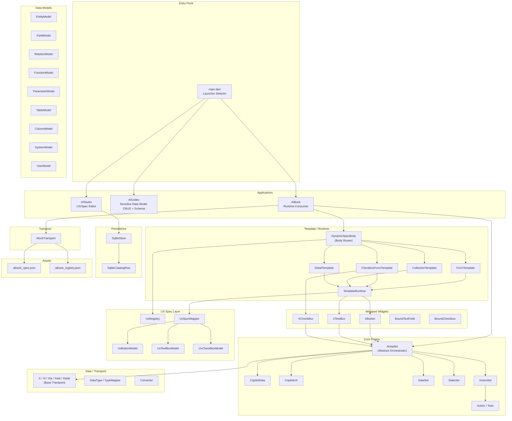
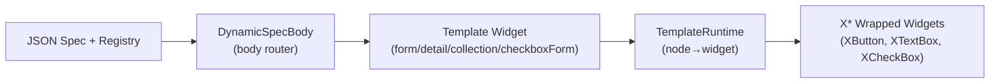
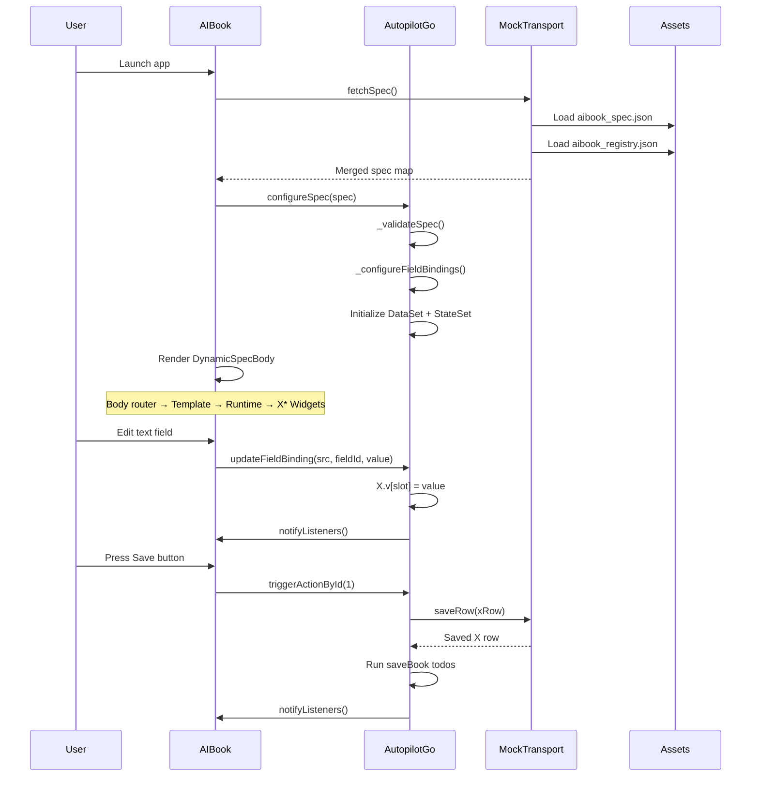
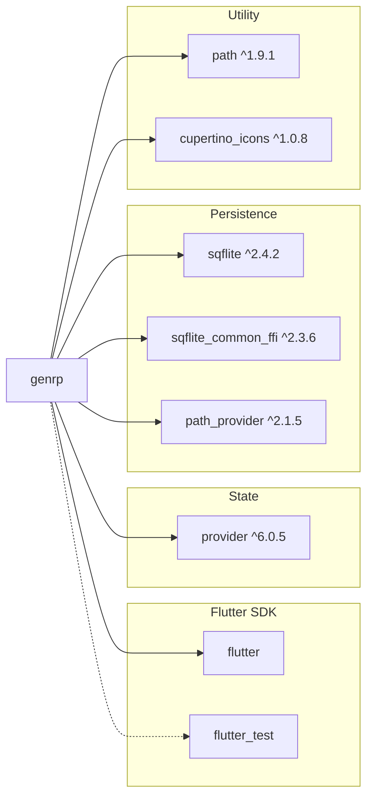

# GenRP — Deep Project Analysis

> **Project:** `genrp` — Generative Resource Planner  
> **Platform:** Flutter (multi-platform: macOS, Linux, Windows, Android, iOS, Web shell)  
> **SDK:** Dart ≥3.11.0  
> **Analysis Date:** 2026-03-19  

---

## 1. Executive Summary

GenRP is a **Flutter monolith** containing **three distinct applications** inside a single codebase, unified by a shared `core` library:

| App | Role | Maturity |
|---|---|---|
| **AIBook** | Runtime reader / preview flow (function-driven business-data consumer) | ~80% beta; Step 2 done, Step 3 pending |
| **AIStudio** | UX/spec editing surface (UX model-spec CRUD) | Step 2 done; Step 3 pending |
| **AICodex** | Sensitive data-model CRUD + schema-application surface | Step 1 done; paused before Step 2 |

The apps share a common orchestration engine (`Autopilot`), data models, UX spec models, a JSON-driven UI composition system, and a local SQLite persistence layer. The repo now also has a shared DB contract/admin-client scaffold for PostgreSQL, SQLite, and web action payloads. The architecture is intentionally lean, performance-first, and optimized for compact numeric transport.

---

## 2. Architecture Overview



---

## 3. Codebase Statistics

| Metric | Value |
|---|---|
| **Source files** (`lib/`) | 56 Dart files |
| **Source LOC** (`lib/`) | ~4,307 lines |
| **Test files** (`test/`) | 13 Dart files |
| **Test LOC** (`test/`) | ~1,207 lines |
| **Asset JSON files** | 3 files |
| **Doc files** (`docs/`) | 10 markdown files |
| **Dependencies** | flutter, cupertino_icons, path, path_provider, provider, sqflite, sqflite_common_ffi |
| **Dev Dependencies** | flutter_test, flutter_lints |

---

## 4. Directory Structure

```
genrp/
├── lib/
│   ├── main.dart                         # App launcher / selector
│   ├── meta.dart                         # Static version flags
│   ├── app/
│   │   ├── aibook/
│   │   │   ├── aibook.dart               # AIBook entry (MaterialApp + Provider)
│   │   │   └── autopilotgo.dart          # Concrete Autopilot for AIBook
│   │   ├── aicodex/
│   │   │   └── aicodex.dart              # AICodex Step 1 shell (currently paused before Step 2)
│   │   └── aistudio/
│   │       └── aistudio.dart             # AIStudio Step 2 shell (UX/spec explorer + selection state)
│   └── core/
│       ├── agent/
│       │   ├── action.dart               # Action + Todo models
│       │   ├── action_set.dart           # Action registry + dispatch
│       │   ├── autopilot.dart            # Abstract orchestrator
│       │   ├── copilot_data.dart         # Data copilot (reads/writes DataSet)
│       │   ├── copilot_ux.dart           # UX copilot (reads/writes StateSet)
│       │   ├── data_set.dart             # Key/value data store
│       │   ├── mock_transport.dart       # Mock fetch/save boundary
│       │   └── state_set.dart            # Key/value state store
│       ├── base/
│       │   ├── bootstrap.dart            # System bootstrap defaults, seed rows, update helpers
│       │   ├── converter.dart            # Tolerant type conversion helpers
│       │   ├── data_type.dart            # DataType registry + TypeMapper
│       │   ├── sysfunc.dart              # System function entrypoint seeds
│       │   ├── systable.dart             # System table entrypoint seeds
│       │   ├── systype.dart              # System target-kind entrypoint seeds
│       │   └── x.dart                    # Base transport classes (X hierarchy)
│       ├── db/
│       │   ├── datasource_helper.dart    # Empty placeholder
│       │   ├── db_contract.dart          # Shared DB specs + SQL helpers
│       │   ├── pgsqladmin.dart           # PostgreSQL create-db/table/function builder
│       │   ├── pgsqlclient.dart          # PostgreSQL foundation CRUD builder
│       │   ├── sqlite_store.dart         # SQLite store + SqliteCatalogRow
│       │   ├── sqliteadmin.dart          # SQLite create-db/table/virtualfun builder
│       │   ├── sqliteclient.dart         # SQLite foundation CRUD builder
│       │   └── webclient.dart            # Generic web action/CRUD envelope builder
│       ├── generator/
│       │   └── boilerplate_generator.dart# DynamicSpecBody (body router)
│       ├── model/
│       │   ├── models.dart               # Barrel export
│       │   ├── data/                     # 9 data model files
│       │   └── ux/                       # 6 UX model/registry files
│       ├── runtime/
│       │   └── template_runtime.dart     # JSON→Widget runtime renderer
│       ├── template/                     # 4 template widgets
│       └── widgets/                      # 5 wrapped control widgets
├── test/                                 # 12 test files
├── assets/json/                          # 3 JSON spec/registry files
├── docs/                                 # 10 documentation files
└── pubspec.yaml
```

---

## 5. Core Subsystem Analysis

### 5.1 Orchestration Engine (`core/agent/`)

The **Autopilot** is the heart of the system — an abstract `ChangeNotifier` that owns all runtime state:

| Component | Purpose |
|---|---|
| [autopilot.dart](lib/core/agent/autopilot.dart) | Abstract orchestrator: field binding resolution (path + slot), UX identity selection, action dispatch |
| [copilot_data.dart](lib/core/agent/copilot_data.dart) | Thin facade over `DataSet` — reads/writes business data + publishes changes |
| [copilot_ux.dart](lib/core/agent/copilot_ux.dart) | Thin facade over `StateSet` — reads/writes UX state + publishes changes |
| [data_set.dart](lib/core/agent/data_set.dart) | `Map<String, dynamic>` store with smart `x_row.v.N` slot interception |
| [state_set.dart](lib/core/agent/state_set.dart) | Simple `Map<String, dynamic>` store for UX/UI state |
| [action_set.dart](lib/core/agent/action_set.dart) | Named + ID-keyed action registry with handler dispatch |
| [action.dart](lib/core/agent/action.dart) | `Action` model (id, name, ordered `Todo` list) — GCD pattern |
| [mock_transport.dart](lib/core/agent/mock_transport.dart) | Loads merged spec/registry from assets, simulates save delay |

**Key design decisions:**
- `CopilotData` and `CopilotUX` are **intentionally separate** (split concerns, never merge).
- Binding resolution is **dual-path**: slot-first `X.v[index]` for machine transport, fallback to string path for migration.
- Source codes: `0` = state, `1` = dataSource, `2` = dataSet.
- UX identity is scoped as `hostId + bodyId + widgetId` — used for selection highlighting in debug mode.

### 5.2 Transport Layer (`core/base/`)

| Class | Fields | Purpose |
|---|---|---|
| `X` | `v: List<dynamic>` | Base transport with compact payload list |
| `Xi` | `i, v` | + integer ID |
| `Xia` | `i, a, v` | + active flag |
| `Xiad` | `i, a, d, v` | + date/discriminator |
| `Xiade` | `i, a, d, e, v` | + entity reference |

All implement `fromJson` / `toJson`. The `v` list is the **slot-addressable payload** — field bindings resolve to `v[slot]` by design.

**`DataType` / `TypeMapper`** provides a cross-platform type registry (Dart ↔ PostgreSQL ↔ SQLite ↔ JSON):
- Built-in types 0–11 (bool, Int32, Int53, Int64, Double, Binary, Json, Jsonb, Guid, String, Base64)
- Dynamic numeric types: ID > 99 encodes `Numeric(whole, scale)` via `id % 100` / `id ~/ 100`

**`Converter`** provides null-safe, tolerant type conversions (`toInt`, `toDouble`, `toBool`, `toStr`, `tryInt`).

### 5.3 Data Models (`core/model/data/`)

Four of the nine models currently share the generic row shape `i, a, d, e, t, n, s` exactly. `FunctionModel` and `EntityModel` keep that shape and add `tis` for dependent table IDs, `FieldModel` adds `ci` for mapped column ID, `ParameterModel` uses `fi` for function ID, and `SystemModel` is a structural metadata model with its own field set. `ActionModel` has moved to `core/model/ux/`.

| Field | Type | Semantics |
|---|---|---|
| `i` | `int` | ID |
| `a` | `bool` | Active flag |
| `d` | `int` | Date/discriminator |
| `e` | `int` | Entity reference |
| `t` | `int` | Type reference |
| `n` | `String` | Readable/display name |
| `s` | `String` | System name / slug, preferably lower snake_case |

**Models:** `EntityModel`, `FieldModel`, `RelationModel`, `FunctionModel`, `ParameterModel`, `TableModel`, `ColumnModel`, `SystemModel`, `UserModel`

**`ParameterModel`** fields:
- `i`, `a`, `d`, `e`, `n`, `s` — same role as the common row models
- `fi` — function ID foreign key
- Parameters are input-only in the current architecture; returned data shape is expected to come from fields/result structure rather than output parameters

**`FunctionModel`** fields:
- `i`, `a`, `d`, `e`, `t`, `n`, `s` — same role as the common row models, with `t` indicating function type
- `ei` — output entity foreign key indicating which entity the function returns
- Function type vocabulary: `0 = sys-get`, `1 = sys-set`, `2 = jss-get`, `3 = jss-set`, `4 = biz-get`, `5 = biz-set`
- `tis` — dependent table IDs, with `[0]` as the default when the function has no table dependency

**`EntityModel`** fields:
- `i`, `a`, `d`, `e`, `t`, `n`, `s` — same role as the common row models, with `t` indicating entity type
- `tis` — dependent table IDs, with `[0]` as the default when the entity has no table dependency

**`FieldModel`** fields:
- `i`, `a`, `d`, `e`, `t`, `n`, `s` — same role as the common row models, with `t` indicating field type
- `ci` — mapped column ID foreign key

**`SystemModel`** fields:
- `sid`, `n`, `fv`, `cv` — system identity, app name, framework version, contract version
- `ld`, `lds`, `ldu` — last edited, last synced, last updated timestamps
- `ctm` — catalog/table map JSON
- `uxm` — UX map JSON
- `m1`, `m2` — reserved future meta JSON buckets

All are immutable with `const` constructor, `fromJson`, `toJson`, `copyWith`, `==`, `hashCode`, but `SystemModel` is a special structural metadata case rather than a normal generic row.

**Semantic roles by app:**
- **AICodex**: owns CRUD for these sensitive data-model rows and uses them as schema-generation input for create/drop/function-script flows
- **AIStudio**: may read some of them for context, but its main CRUD surface is UX/spec rather than the sensitive data-model layer
- **AIBook**: uses the resulting business-data surface through function-driven CRUD (not direct authoring)

### 5.4 UX Spec Models (`core/model/ux/`)

| File | Class | Extra Fields |
|---|---|---|
| [action_model.dart](lib/core/model/ux/action_model.dart) | `ActionModel` | UX-side action metadata; moved from `data/` |
| [ux_button_model.dart](lib/core/model/ux/ux_button_model.dart) | `UxButtonModel` | `hostId, bodyId, actionId, actionName` |
| [ux_text_box_model.dart](lib/core/model/ux/ux_text_box_model.dart) | `UxTextBoxModel` | `hostId, bodyId, bind, src, fieldId` |
| [ux_checkbox_model.dart](lib/core/model/ux/ux_checkbox_model.dart) | `UxCheckBoxModel` | `hostId, bodyId, bind, src, fieldId` |
| [ux_registry.dart](lib/core/model/ux/ux_registry.dart) | `UxRegistry` | `hosts, bodies, templates, types, widgets` — maps `int → String` |
| [ux_spec_mapper.dart](lib/core/model/ux/ux_spec_mapper.dart) | `UxSpecMapper` | Converts raw JSON nodes → typed UX models |

### 5.5 Rendering Pipeline (`core/runtime/` + `core/template/` + `core/generator/`)



1. **DynamicSpecBody** (body router): Resolves `body` by numeric ID first → falls back to string name → selects template
2. **Templates** (4 types): `FormTemplate`, `CheckboxFormTemplate`, `CollectionTemplate`, `DetailTemplate` — each creates a scrollable layout and delegates node rendering to `TemplateRuntime`
3. **TemplateRuntime**: Statically registers node builders for `column`, `spacer`, `textField`, `button`, `text`. Resolves `typeId` to type name via `UxRegistry`.
4. **X* Widgets**: `XButton`, `XTextBox`, `XCheckBox` — fully bound to `Autopilot` for value resolution, change propagation, action dispatch, and debug selection highlighting.

> [!IMPORTANT]
> Body routing is still **hybrid** — it tries numeric `bodyId` first but falls back to string names. This is a documented beta gap.

### 5.6 Persistence (`core/db/`)

**Shared DB scaffold** — generic DB specs and builders now sit beside the SQLite store:

| Component | Purpose |
|---|---|
| `db_contract.dart` | Shared specs for database, table, function, and CRUD generation |
| `pgsqladmin.dart` | PostgreSQL create-database, create-table, create-function SQL |
| `sqliteadmin.dart` | SQLite create-database, create-table, and `virtualfun` row/script generation |
| `pgsqlclient.dart` / `sqliteclient.dart` | Direct CRUD builders for foundation targets; business direct CRUD is rejected |
| `webclient.dart` | Generic request payload builder for remote action/function calls |
| `systable.dart` / `sysfunc.dart` / `systype.dart` | Base-layer entrypoint seeds for table, function, and target-kind routing |

**`SqliteStore`** — A generic local SQLite foundation:

| Table | Purpose | Key |
|---|---|---|
| `app_kv` | JSON key/value storage | `k TEXT PRIMARY KEY` |
| `catalog_row` | Generic catalog row storage | `(catalog, i) COMPOSITE PK`, seeded with default `System` metadata |

`SqliteCatalogRow` mirrors the common model shape (`i, a, d, e, t, n, s`) plus `catalog`, `payload` (JSON), `updatedAt`.

- Platform-aware: desktop uses `sqflite_common_ffi`, mobile uses `sqflite`, web throws `UnsupportedError`
- Singleton pattern via `SqliteStore.instance`
- Supports custom `databaseFactory` and `databasePath` injection for testing
- Applies shared foundation seed rows on first create
- PostgreSQL can use real foundation/business functions, while SQLite represents function-like behavior through `virtualfun` rows/scripts instead of database functions
- Generated table builders currently emit `NOT NULL` for all columns
- `ALTER TABLE` is intentionally not part of the current flow

> [!NOTE]
> `datasource_helper.dart` is an empty file — reserved for future use.

### 5.7 Application Layer (`app/`)

#### AIBook (~80% beta)
- **Entry**: `AIBookApp` → wraps a `ChangeNotifierProvider<AutopilotGo>`
- **Home**: `_AIBookHome` → `FutureBuilder` loads spec via `MockTransport`, configures `AutopilotGo`, renders `DynamicSpecBody`
- **AutopilotGo**: Concrete `Autopilot` — validates duplicate IDs plus field/action/template/type references, configures field bindings (path + slot), converts `x_row` initial data to `X`, registers named actions with `_runAction` handler
- **Action execution**: Handles `saveBook` specially (saves `X` row via MockTransport), then iterates `Todo` list for state mutations
- **Near-term gap**: shared `WebClient` payload scaffolding exists, but real HTTP transport is still pending

#### AIStudio (Step 2 done)
- **Entry**: `AIStudioApp` → three-panel shell with UX/spec left navigation
- Left panel: UX/spec explorer list (Host, Body, Template, Type, Widget, UX Action, FieldBinding, Body Spec Node)
- Local state: `_selectedCatalog`, `_selectedRowId`
- Middle panel: selected catalog header + placeholder body
- Right panel: placeholder
- Current direction: AIStudio should focus on UX/spec CRUD; any remaining data-model catalogs in the shell are transitional/reference only until the UI is narrowed further
- Shared DB builders exist, but SQLite wiring and remaining UX/spec editor work are still pending

#### AICodex (Step 1 done, currently paused)
- **Entry**: `AICodexApp` → three-panel shell with grouped model navigation
- Left: grouped model types with selection highlighting
- Middle: selected model type header + placeholder body
- Right: placeholder
- Current direction: AICodex owns sensitive data-model CRUD plus schema generation/apply work
- SQLite master list, editable detail panel, and DDL generation are still pending when work resumes

---

## 6. Data Flow Diagram



---

## 7. Backend Transport Contract

The planned backend is a **C# ASP.NET Core Minimal Web API** with a PostgreSQL backend and a distinct local SQLite role:

| Aspect | Design |
|---|---|
| **Endpoint** | Single URL, `POST` only |
| **Request body** | `{ "a": <actionId>, "u": "<user>", "p": "<password>", "data": {...} }` |
| **Server behavior** | JSON passthrough — C# does NOT map to business objects |
| **DB behavior** | PostgreSQL owns the router function, returns JSON directly |
| **Foundation structures** | Both PostgreSQL and SQLite can have bootstrap/foundation tables |
| **Function layer** | PostgreSQL can use real functions; SQLite should use a `virtualfun` script store instead |
| **Foundation CRUD** | Direct CRUD is allowed |
| **Business CRUD** | Function-style actions only |
| **Edit rule** | Inside `edit<ModelName>`: `data.i == 0` → create, `data.i > 0` → update, `data.a = false` → treat as delete through the function payload |
| **No alter table** | By design |
| **No hard delete** | By design |

> [!WARNING]
> Currently only `MockTransport` exists. The real transport boundary has not been implemented yet.

---

## 8. Naming Conventions & Vocabulary

| Term | Meaning |
|---|---|
| `body` | The swapped `Scaffold.body` content region only |
| `Ux*Model` | Definition-side UX/UI data (e.g., `UxButtonModel`) |
| `X*` (under `widgets/`) | Wrapped implementation controls (e.g., `XButton`, `XTextBox`) |
| `X` / `Xi` / `Xia` / `Xiad` / `Xiade` (under `base/`) | Business-bound transport/data shapes |
| `Autopilot` | The single orchestrator — owns all binding, state, actions |
| `CopilotData` / `CopilotUX` | Separate data and UX state facades (never merge) |
| `Todo` | A single step within an `Action` |
| `slot` | Direct index into `X.v[]` for field binding resolution |
| `src` | Binding source: `0` = state, `1` = dataSource, `2` = dataSet |
| `i/a/d/e/t/n/s` | Common model field abbreviations for the generic row models (id, active, date, entity, type, readable name, system name) |
| `sys-get / sys-set / jss-get / jss-set / biz-get / biz-set` | Function type vocabulary carried by `FunctionModel.t` |
| `ei` | Output entity foreign key used by `FunctionModel` |
| `tis` | Table ID array used by `FunctionModel` and `EntityModel` for zero/one/many table dependencies |
| `ci` | Column ID foreign key used by `FieldModel` |
| `fi` | Function ID foreign key used by `ParameterModel` |

---

## 9. JSON Spec & Registry Structure

### aibook_spec.json
Defines UI **composition** — what bodies exist, what widgets they contain, initial state/data:

```
{
  "id": "aibook-small-scale",
  "toolbar": { "title": "AIBook Test" },
  "initialBody": 1,
  "initialState": { "currentBody": 1, "status": "Ready" },
  "initialData": { "book.title": "...", "x_row": { "v": [...] } },
  "bodies": {
    "editor": { bodyId, templateId, checkbox, children: [...] },
    "preview": { bodyId, templateId, children: [...] }
  }
}
```

### aibook_registry.json
Defines **identity registries** — maps numeric IDs to names:

```
{
  "hosts": [{ "id": 0, "name": "main" }, ...],
  "bodies": [{ "id": 1, "name": "editor" }, ...],
  "templates": [{ "id": 1, "name": "checkboxForm" }, ...],
  "types": [{ "id": 1, "name": "column" }, ...],
  "widgets": [{ "id": 101, "name": "editor.savedCheckbox" }, ...],
  "fieldBindings": [{ "src": 1, "fieldId": 101, "path": "data.book.title", "slot": 0 }, ...],
  "actions": [{ "id": 1, "name": "saveBook", "todos": [...] }, ...]
}
```

---

## 10. Test Coverage

| Test File | Coverage Target |
|---|---|
| `aibook_app_test.dart` | AIBook app widget test |
| `autopilot_slot_test.dart` | Slot-first read/write for base `X` |
| `boilerplate_generator_test.dart` | DynamicSpecBody routing |
| `db_clients_test.dart` | DB admin/client builders + system entrypoint seeds |
| `main_app_test.dart` | Main launcher widget test |
| `mock_transport_test.dart` | Mock transport save behavior |
| `sqlite_store_test.dart` | SQLite store CRUD + KV |
| `system_model_test.dart` | SystemModel structural metadata serialization |
| `template_runtime_test.dart` | TemplateRuntime node rendering |
| `validation_test.dart` | Current spec validation coverage |
| `x_button_test.dart` | XButton widget behavior |
| `x_input_controls_test.dart` | XTextBox + XCheckBox widget behavior |

---

## 11. Current Status & Gap Analysis

### What's Working ✅

| Capability | Status |
|---|---|
| App launcher with one-way selection | ✅ Stable |
| AIBook spec loading from assets | ✅ Working |
| UX registry for numeric identity resolution | ✅ Working |
| Dual binding (slot-first + path fallback) | ✅ Working |
| Action dispatch (name + ID) | ✅ Working |
| ToDo-based action execution | ✅ Working |
| XButton, XTextBox, XCheckBox widgets | ✅ Working |
| Body routing (hybrid numeric + string) | ✅ Partial |
| Debug selection highlighting | ✅ Working |
| SQLite store (shared foundation) | ✅ Working |
| Spec validation (duplicate IDs + key references) | ✅ Working |
| flutter analyze | ✅ Passes |
| flutter test | ✅ Passes |

### Known Gaps ⚠️

| Gap | Priority | Notes |
|---|---|---|
| Body routing still partly string-driven | High | Numeric-first with string fallback; needs cleanup |
| Hybrid slot + path binding at runtime | High | Slot binding works but path fallback still active everywhere |
| Mock-only runtime transport | High | `WebClient` envelope builder exists, but no real web/API transport path is wired yet |
| SQLite not wired into AIBook | Medium | Store exists but AIBook doesn't use it for cache |
| Validation still partial | Medium | Key references are checked, but deeper consistency/body-template validation is still missing |
| Shared DB builders not wired into app flows yet | Medium | Contract/admin/client scaffolding exists, but app-level integration is still pending |
| AIStudio only has local selection state | Medium | UX/spec catalog selection exists; SQLite list/editor flow is still missing |
| AIStudio not wired to SQLite | Medium | Left panel lists exist but no UX/spec persistence yet |
| AICodex paused after Step 1 | Medium | Middle/right panels are still placeholders; resume directly when ready because it now owns sensitive data-model CRUD |
| Preview selection is debug-only | Low | Long-press in debug mode only |
| `datasource_helper.dart` is empty | Low | Reserved placeholder |
| No route navigation (intentional) | N/A | Architecture decision: body swap only |

---

## 12. Architectural Patterns & Principles

### Design Philosophy
1. **Performance first** — flat JSON, low-overhead lookups, minimal abstraction
2. **Numeric identity** — integer IDs for action, template, widget, type, source, field references
3. **Compact transport** — base `X` with slot-addressable `v[]` list, not human-readable property maps
4. **Single orchestrator** — `Autopilot` owns everything; no competing state managers
5. **Incremental migration** — string fallbacks preserved alongside numeric-first resolution
6. **No routing** — single `Scaffold`, body swap only

### Key Patterns
- **Provider + ChangeNotifier** — `AutopilotGo extends Autopilot extends ChangeNotifier`
- **GCD (Grand Central Dispatch)** — Actions contain ordered `Todo` lists executed sequentially
- **Spec-driven UI** — JSON defines composition, runtime renders predefined templates/widgets
- **Dual source separation** — UX/UI composition via JSON, business data via base `X` transport
- **Copilot split** — `CopilotData` and `CopilotUX` intentionally separate (never merge)

---

## 13. Dependency Graph



> [!TIP]
> The dependency set is intentionally minimal. No heavy frameworks, no code generators, and no real runtime HTTP transport yet.

---

## 14. Recommended Roadmap

Based on the existing handover docs and code analysis:

### Phase 1: Finish AIBook Beta Hardening
1. **Extend spec validation further** — deeper consistency checks, body/template rules, and missing IDs
2. **Complete slot-first binding coverage** — add stronger slot-vs-path tests
3. **Replace MockTransport** — implement real HTTP transport for composition JSON + business-function actions
4. **Wire SQLite into AIBook** — cache spec and/or `X` row data locally

### Phase 2: Continue AIStudio
5. **Build middle panel** — SQLite-backed row list for selected UX/spec catalog
6. **Build right panel** — UX/spec editor for common `i/a/d/e/t/n/s` shape + JSON payload
7. **Add AIStudio test coverage** — panel behavior + SQLite CRUD flow

### Phase 3: Resume AICodex
9. **Build master list from SQLite** — rows for the selected data-model type plus add entrypoint
10. **Build editable detail panel** — sensitive data-model CRUD for selected rows
11. **Add DDL generation** — create/drop/function SQL + `virtualfun` script preview
12. **Add transport + test coverage** — schema action dispatch, `virtualfun` handling, and widget tests

### Phase 4: Production Hardening
13. **Harden failure states** — malformed spec, registry, transport errors
14. **Decide on preview mode** — debug-only vs. production feature
15. **Expand full-flow integration coverage** — editor → preview → transport/cache paths

---

## 15. File Reference

### Source Files (`lib/` — 55 files)

| Category | Files |
|---|---|
| **Entry** | [main.dart](lib/main.dart), [meta.dart](lib/meta.dart) |
| **AIBook app** | [aibook.dart](lib/app/aibook/aibook.dart), [autopilotgo.dart](lib/app/aibook/autopilotgo.dart) |
| **AICodex app** | [aicodex.dart](lib/app/aicodex/aicodex.dart) |
| **AIStudio app** | [aistudio.dart](lib/app/aistudio/aistudio.dart) |
| **Agent/Orchestration** | [autopilot.dart](lib/core/agent/autopilot.dart), [copilot_data.dart](lib/core/agent/copilot_data.dart), [copilot_ux.dart](lib/core/agent/copilot_ux.dart), [data_set.dart](lib/core/agent/data_set.dart), [state_set.dart](lib/core/agent/state_set.dart), [action_set.dart](lib/core/agent/action_set.dart), [action.dart](lib/core/agent/action.dart), [mock_transport.dart](lib/core/agent/mock_transport.dart) |
| **Base transport + registries** | [x.dart](lib/core/base/x.dart), [data_type.dart](lib/core/base/data_type.dart), [converter.dart](lib/core/base/converter.dart), [systable.dart](lib/core/base/systable.dart), [sysfunc.dart](lib/core/base/sysfunc.dart), [systype.dart](lib/core/base/systype.dart) |
| **Persistence** | [sqlite_store.dart](lib/core/db/sqlite_store.dart), [db_contract.dart](lib/core/db/db_contract.dart), [pgsqladmin.dart](lib/core/db/pgsqladmin.dart), [pgsqlclient.dart](lib/core/db/pgsqlclient.dart), [sqliteadmin.dart](lib/core/db/sqliteadmin.dart), [sqliteclient.dart](lib/core/db/sqliteclient.dart), [webclient.dart](lib/core/db/webclient.dart), [datasource_helper.dart](lib/core/db/datasource_helper.dart) |
| **Generator** | [boilerplate_generator.dart](lib/core/generator/boilerplate_generator.dart) |
| **Data models** (9) | [entity_model.dart](lib/core/model/data/entity_model.dart), [field_model.dart](lib/core/model/data/field_model.dart), [relation_model.dart](lib/core/model/data/relation_model.dart), [function_model.dart](lib/core/model/data/function_model.dart), [parameter_model.dart](lib/core/model/data/parameter_model.dart), [table_model.dart](lib/core/model/data/table_model.dart), [column_model.dart](lib/core/model/data/column_model.dart), [system_model.dart](lib/core/model/data/system_model.dart), [user_model.dart](lib/core/model/data/user_model.dart) |
| **UX models** (6) | [action_model.dart](lib/core/model/ux/action_model.dart), [ux_button_model.dart](lib/core/model/ux/ux_button_model.dart), [ux_text_box_model.dart](lib/core/model/ux/ux_text_box_model.dart), [ux_checkbox_model.dart](lib/core/model/ux/ux_checkbox_model.dart), [ux_registry.dart](lib/core/model/ux/ux_registry.dart), [ux_spec_mapper.dart](lib/core/model/ux/ux_spec_mapper.dart) |
| **Runtime** | [template_runtime.dart](lib/core/runtime/template_runtime.dart) |
| **Templates** (4) | [form_template.dart](lib/core/template/form_template.dart), [checkbox_form_template.dart](lib/core/template/checkbox_form_template.dart), [collection_template.dart](lib/core/template/collection_template.dart), [detail_template.dart](lib/core/template/detail_template.dart) |
| **Widgets** (5) | [x_button.dart](lib/core/widgets/x_button.dart), [x_text_box.dart](lib/core/widgets/x_text_box.dart), [x_checkbox.dart](lib/core/widgets/x_checkbox.dart), [bound_text_field.dart](lib/core/widgets/bound_text_field.dart), [bound_checkbox.dart](lib/core/widgets/bound_checkbox.dart) |

### Documentation (`docs/` — 10 files)

| File | Content |
|---|---|
| [README.md](docs/README.md) | Index of all docs |
| [aibook_handover.md](docs/aibook_handover.md) | AIBook progress, handover plan, copy-paste prompt |
| [aistudio_handover.md](docs/aistudio_handover.md) | AIStudio progress, handover plan, copy-paste prompt |
| [aicodex_handover.md](docs/aicodex_handover.md) | AICodex progress, handover plan, copy-paste prompt |
| [project_deep_analysis.md](docs/project_deep_analysis.md) | Full architecture analysis, gap review, and roadmap |
| [lib_app_readme.md](docs/lib_app_readme.md) | App entry-point overview, transport contract, vocabulary |
| [lib_core_base_data_type_readme.md](docs/lib_core_base_data_type_readme.md) | DataType + TypeMapper docs |
| [lib_core_base_x_readme.md](docs/lib_core_base_x_readme.md) | Base X transport classes docs |
| [lib_core_db_sqlite_store_readme.md](docs/lib_core_db_sqlite_store_readme.md) | SQLite store docs |
| [lib_core_model_data_readme.md](docs/lib_core_model_data_readme.md) | Data model directory docs |
