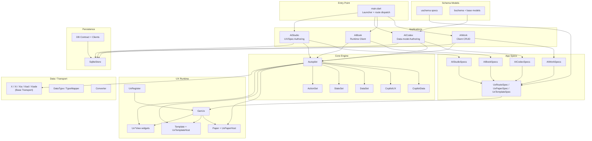
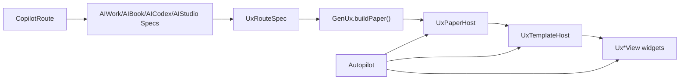
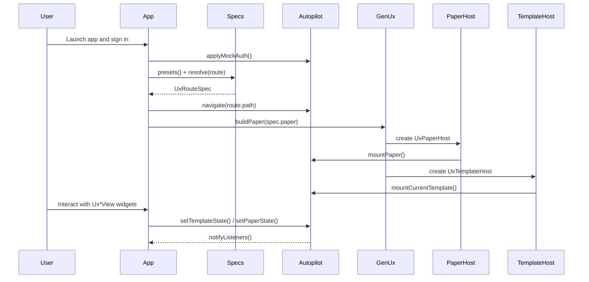
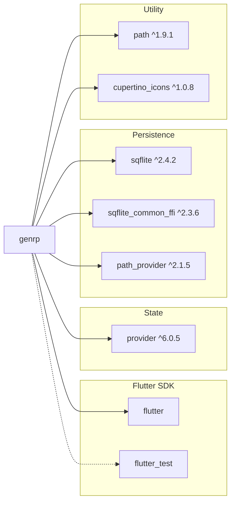

# GenRP — Deep Project Analysis

> **Project:** `genrp` — Generative Resource Planner  
> **Platform:** Flutter (multi-platform: macOS, Linux, Windows, Android, iOS, Web shell)  
> **SDK:** Dart ≥3.11.0  
> **Analysis Date:** 2026-03-20  

---

## 1. Executive Summary

GenRP is a **Flutter monolith** containing **four distinct applications** inside a single codebase, unified by a shared `core` library:

| App | Role | Maturity |
|---|---|---|
| **AIWork** | Client/workflow CRUD surface | Active beta scaffold |
| **AIBook** | Client/runtime reader surface | Active beta scaffold |
| **AIStudio** | UX/spec authoring surface | Active beta scaffold |
| **AICodex** | Sensitive data-model authoring + schema-application surface | Active beta scaffold |

The apps share a common orchestration engine (`Autopilot`), `uschema` route/paper/template/view specs, a spec-driven UX composition system centered on `GenUx`, and a local SQLite persistence layer. The repo also has shared DB contract/admin/client scaffolding for PostgreSQL, SQLite, and web action payloads. The architecture is intentionally lean, numeric-first, and optimized around a small set of reusable UX primitives.

The current UI direction is to keep `AIStudio` and `AICodex` converged on one **hybrid authoring shell**: a left-side minor panel plus a right-side major panel. The major panel changes between one-panel and two-panel modes through tabs, so the apps differ by domain responsibility rather than by inventing different outer layouts. The current working split is `20 / 60 / 20` in dual mode, with the left minor panel and right detail panel intentionally matching widths. The shared shell contract should stay narrow: layout, tab mechanism, width ratios, and chrome styling only. Left-side explorer/list behavior should remain app-specific.

The current visual baseline is a shared **Material 3 theme** owned by `UxTheme` in `lib/core/theme/theme.dart`, with centralized typography and chrome sizing. The launcher, AIWork, AIBook, AIStudio, and AICodex share the same toolbar-height and bottom-status sizing rules, and scaffold-level FABs have been removed in favor of in-panel or header actions.

The data-model layer is the foundation of the whole system because it is the actual schema side: the sitting table/function definitions from which runtime and UX layers are derived. That layer is intentionally single origin, single source of truth, and single user under `AICodex`. On authoring surfaces, new schema-side rows should begin as drafts with `i = 0`; save/edit then decides insert vs update and allocates `max(i) + 1` only when the draft is first persisted.

---

## 2. Architecture Overview



---

## 3. Codebase Statistics

| Metric | Value |
|---|---|
| **Source files** (`lib/`) | 82 Dart files |
| **Source LOC** (`lib/`) | ~7,815 lines |
| **Test files** (`test/`) | 0 Dart files in the current working tree |
| **Test LOC** (`test/`) | 0 |
| **Asset JSON files** | 3 files |
| **Doc files** (`docs/`) | 10 markdown files |
| **Dependencies** | flutter, cupertino_icons, path, path_provider, provider, sqflite, sqflite_common_ffi |
| **Dev Dependencies** | flutter_test, flutter_lints |
| **Analyzer status** | `flutter analyze lib test` passes on 2026-03-20 |

---

## 4. Directory Structure

```
genrp/
├── lib/
│   ├── main.dart                         # App launcher / selector
│   ├── meta.dart                         # Static version flags
│   ├── app/
│   │   ├── aiwork/
│   │   │   ├── aiwork.dart               # AIWork MaterialApp + stage flow
│   │   │   └── aiwork_specs.dart         # AIWork preset routes and papers
│   │   ├── aibook/
│   │   │   ├── aibook.dart               # AIBook MaterialApp + stage flow
│   │   │   └── aibook_specs.dart         # AIBook preset routes and papers
│   │   ├── aicodex/
│   │   │   ├── aicodex.dart              # AICodex MaterialApp + stage flow
│   │   │   └── aicodex_specs.dart        # AICodex preset routes and papers
│   │   └── aistudio/
│   │       ├── aistudio.dart             # AIStudio MaterialApp + stage flow
│   │       └── aistudio_specs.dart       # AIStudio preset routes and papers
│   └── core/
│       ├── agent/
│       │   ├── action_set.dart           # Action registry + dispatch helpers
│       │   ├── autopilot.dart            # Orchestrator + scoped state/auth/navigation
│       │   ├── copilot_data.dart         # Data facade over DataSet
│       │   ├── copilot_route.dart        # Route parsing + path model
│       │   ├── copilot_ux.dart           # UX facade over StateSet
│       │   ├── data_set.dart             # Key/value data store
│       │   └── state_set.dart            # Key/value state store
│       ├── base/
│       │   ├── bootstrap.dart            # System bootstrap defaults, seed rows, update helpers
│       │   ├── converter.dart            # Tolerant type conversion helpers
│       │   ├── data_type.dart            # DataType registry + TypeMapper
│       │   ├── sysfunc.dart              # System function entrypoint seeds
│       │   ├── systable.dart             # System table entrypoint seeds
│       │   ├── systype.dart              # System target-kind entrypoint seeds
│       │   └── x.dart                    # Base transport classes (X hierarchy)
│       ├── db/
│       │   ├── datasource_helper.dart    # Empty placeholder
│       │   ├── db_contract.dart          # Shared DB specs + SQL helpers
│       │   ├── pgsqladmin.dart           # PostgreSQL create-db/table/function builder
│       │   ├── pgsqlclient.dart          # PostgreSQL foundation CRUD builder
│       │   ├── sqlite_store.dart         # SQLite store + SqliteCatalogRow
│       │   ├── sqliteadmin.dart          # SQLite create-db/table/vfun builder
│       │   ├── sqliteclient.dart         # SQLite foundation CRUD builder
│       │   └── webclient.dart            # Generic web action/CRUD envelope builder
│       ├── model/
│       │   ├── bdata/                    # 1 business data model file
│       │   ├── base/                     # 2 base model files
│       │   ├── bschema/                  # 7 schema model files
│       │   └── uschema/                  # UX spec files + barrel export
│       ├── theme/
│       │   └── theme.dart                # Shared Material 3 theme + UX chrome helpers
│       └── ux/
│           ├── genux.dart                # Spec-to-widget runtime builder
│           ├── paper.dart                # Paper contract + scoped host
│           ├── template.dart             # Template contract + scoped host
│           ├── ux.dart                   # UX barrel export
│           ├── ux_register.dart          # Packed ids + UX naming registry
│           ├── v.dart                    # View contract mixin
│           ├── paper/                    # Paper widgets
│           ├── template/                 # Template widgets
│           └── view/                     # Reusable UX views
├── test/                                 # Currently empty in this working tree
├── assets/json/                          # 3 JSON spec/registry files
├── docs/                                 # 10 documentation files
└── pubspec.yaml
```

---

## 5. Core Subsystem Analysis

### 5.1 Orchestration Engine (`core/agent/`)

The **Autopilot** is the heart of the system — an abstract `ChangeNotifier` that owns all runtime state:

| Component | Purpose |
|---|---|
| [autopilot.dart](lib/core/agent/autopilot.dart) | Abstract orchestrator: field binding resolution (path + slot), UX identity selection, action dispatch |
| [copilot_data.dart](lib/core/agent/copilot_data.dart) | Thin facade over `DataSet` — reads/writes business data + publishes changes |
| [copilot_route.dart](lib/core/agent/copilot_route.dart) | Narrow app route model with `appName`, `pageSpecId`, `optionalId`, `path`, and `scopeKey` |
| [copilot_ux.dart](lib/core/agent/copilot_ux.dart) | Thin facade over `StateSet` — reads/writes UX state + publishes changes |
| [data_set.dart](lib/core/agent/data_set.dart) | `Map<String, dynamic>` store with smart `x_row.v.N` slot interception |
| [state_set.dart](lib/core/agent/state_set.dart) | Simple `Map<String, dynamic>` store for UX/UI state |
| [action_set.dart](lib/core/agent/action_set.dart) | ID-keyed async action registry used by `Autopilot` |

**Key design decisions:**
- `CopilotData` and `CopilotUX` are **intentionally separate** (split concerns, never merge).
- Binding resolution is **dual-path**: slot-first `X.v[index]` for machine transport, fallback to string path for migration.
- Source codes: `0` = state, `1` = dataSource, `2` = dataSet.
- UX identity is scoped as `hostId + bodyId + widgetId` — used for selection highlighting in debug mode.

### 5.2 Transport Layer (`core/base/`)

| Class | Fields | Purpose |
|---|---|---|
| `X` | `v: List<dynamic>` | Base transport with compact payload list |
| `Xi` | `i, v` | + integer ID |
| `Xia` | `i, a, v` | + active flag |
| `Xiad` | `i, a, d, v` | + date/discriminator |
| `Xiade` | `i, a, d, e, v` | + entity reference |

**X ID direction**
- `Xi.i` can use `max(i) + 1`.
- Richer variants (`Xia`, `Xiad`, `Xiade`) should use epoch-millisecond-based IDs rather than `max(i) + 1`.
- Planned formula direction is `epochMs * 10/100/1000 + suffix`, with suffix inside `0..999`.
- Keep those values within 53-bit safe integer range for web/JSON transport even if PostgreSQL stores them as `bigint`.
- In that family, `d` and `e` are part of the web-safe `int^53` / PostgreSQL `bigint` rule.

All implement `fromJson` / `toJson`. The `v` list is the **slot-addressable payload** — field bindings resolve to `v[slot]` by design.

**`DataType` / `TypeMapper`** provides a cross-platform type registry (Dart ↔ PostgreSQL ↔ SQLite ↔ JSON):
- Built-in types 0–11 (bool, Int32, Int53, Int64, Double, Binary, Json, Jsonb, Guid, String, Base64)
- Dynamic numeric types: ID > 99 encodes `Numeric(whole, scale)` via `id % 100` / `id ~/ 100`

**`Converter`** provides null-safe, tolerant type conversions (`toInt`, `toDouble`, `toBool`, `toStr`, `tryInt`).

### 5.3 BSchema Models (`core/model/bschema/`) and Base Models (`core/model/base/`)

The regular schema-row models now live under `core/model/bschema/`, while the special base models live under `core/model/base/`. Four of the seven regular bschema models currently share the generic row shape `i, a, d, e, t, n, s` exactly. `FunctionModel` and `EntityModel` keep that shape and add `tis` for dependent table IDs, `FieldModel` adds `ci` for mapped column ID, `ParameterModel` uses `fi` for function ID, and `ActionModel` has moved to `core/model/uschema/`.

| Field | Type | Semantics |
|---|---|---|
| `i` | `int` | ID |
| `a` | `bool` | Active flag |
| `d` | `int` | Last date/time, usually UTC epoch milliseconds; web-safe `int^53`, PostgreSQL `bigint` when persisted there |
| `e` | `int` | Last editor reference; `int4` in `base`, `bschema`, and `uschema`, where it points to `UsrModel.i` |
| `t` | `int` | Type reference |
| `n` | `String` | Readable/display name |
| `s` | `String` | System name / slug, preferably lower snake_case |

**Regular data models:** `EntityModel`, `FieldModel`, `RelationModel`, `FunctionModel`, `ParameterModel`, `TableModel`, `ColumnModel`

**Base models:** `SystemModel`, `UsrModel`

**BData models:** `UserModel`

**Physical DB naming reminder:**
- Actual physical database names are not assumed to match the model names directly.
- Current remembered alias direction is:
  - `s0` = `usr`
  - `s1` = `systemmodel`
  - `s2` = `table`
  - `s3` = `column`
  - `s4` = `function`
  - `s5` = `param`
  - `s6` = `entity`
  - `s7` = `field`
- Business tables should start with `t`.
- Current remembered business-table entrypoint is:
  - `t0` = `UserModel`

**`ParameterModel`** fields:
- `i`, `a`, `d`, `e`, `n`, `s` — same role as the common row models
- `fi` — function ID foreign key
- Parameters are input-only in the current architecture; returned data shape is expected to come from fields/result structure rather than output parameters

**`FunctionModel`** fields:
- `i`, `a`, `d`, `e`, `t`, `n`, `s` — same role as the common row models, with `t` indicating function type
- `ei` — output entity foreign key indicating which entity the function returns
- Function type vocabulary: `0 = sys-get`, `1 = sys-set`, `2 = jss-get`, `3 = jss-set`, `4 = biz-get`, `5 = biz-set`
- `tis` — dependent table IDs, with `[0]` as the default when the function has no table dependency

**`EntityModel`** fields:
- `i`, `a`, `d`, `e`, `t`, `n`, `s` — same role as the common row models, with `t` indicating entity type
- `tis` — dependent table IDs, with `[0]` as the default when the entity has no table dependency

**`FieldModel`** fields:
- `i`, `a`, `d`, `e`, `t`, `n`, `s` — same role as the common row models, with `t` indicating field type
- `ci` — mapped column ID foreign key

**`SystemModel`** fields:
- `sid`, `n`, `fv`, `cv` — system identity, app name, framework version, contract version
- `ld`, `lds`, `ldu` — last edited, last synced, last updated timestamps
- `ctm` — catalog/table map JSON
- `uxm` — UX map JSON
- `m1`, `m2` — reserved future meta JSON buckets

**`UsrModel`** status:
- `UsrModel` now lives beside `SystemModel` under `core/model/base/`.
- It should be treated as a special base model rather than a normal generic schema row.
- `UsrModel.i` follows the same `int4` + `max(i) + 1` rule as the rest of the base model layer.
- `UsrModel` represents the system/admin-side user concept. Business users should be modeled separately in the business domain.
- `UsrModel` now uses the same field contract as business-side `UserModel`: `i, d, e, a, u, p, n, x, l`.
- The difference is policy, not field names: `UsrModel.i` and `UsrModel.e` stay on the base-side `int4 + max(i) + 1` rule.
- In schema-side layers, `e` is the last editor and points to `UsrModel.i`.

**`UserModel`** in `bdata`:
- `UserModel` under `core/model/bdata/` is the first business-data model and is distinct from base-side `UsrModel`.
- `UserModel` belongs to the business domain and currently maps to business table entrypoint `t0`.
- Current field contract is `i, d, e, a, u, p, n, x, l`.
- `i`, `d`, `e`, and `x` are intended as int8 / web-safe integers.
- In `bdata` and future `udata`, `i` and `e` should stay web-safe `int^53`.
- In data-side layers, `e` is the last editor and points to `UserModel.i`.
- New rows in `bdata` and `udata` should follow the epoch-millisecond-plus-suffix allocator rather than `max(i) + 1`.
- `a` is bool.
- `u`, `p`, and `n` are text fields for username, password, and name.
- `p` stays plain text for now; no hashing policy is applied yet.
- `l` is the user level and should stay `int4`.

All are immutable with `const` constructor, `fromJson`, `toJson`, `copyWith`, `==`, `hashCode`, but `SystemModel` and `UsrModel` are special base cases rather than normal generic rows, while `bdata/UserModel` is business data.

**Semantic roles by app:**
- **AICodex**: owns CRUD for these sensitive data-model rows and uses them as schema-generation input for create/drop/function-script flows
- **AIStudio**: may read some of them for context, but its main CRUD surface is UX/spec rather than the sensitive data-model layer
- **AIBook**: uses the resulting business-data surface through function-driven CRUD (not direct authoring)
- For this schema layer, primary IDs and explicit structural foreign keys are intended to stay `int4`.
- The shared `d` field is intentionally the broader time integer and should stay web-safe `int^53`, mapping to PostgreSQL `bigint` when persisted there.
- The shared `e` field stays layer-specific: `int4` in `base` / `bschema` / `uschema`, where it points to `UsrModel.i`, and web-safe `int^53` in `bdata` / `udata`, where it points to `UserModel.i`.
- Because schema editing is single-user/admin-side only, `max(i) + 1` is acceptable for model-definition ID allocation.

### 5.4 USchema Models (`core/model/uschema/`)

| File | Class | Extra Fields |
|---|---|---|
| [ux.dart](lib/core/model/uschema/ux.dart) | barrel export | Re-exports the active UX spec types used by apps and `GenUx` |
| [ux_node_spec.dart](lib/core/model/uschema/ux_node_spec.dart) | `UxNodeSpec` | Shared `i`, `s`, `m`, `code`, and `id` contract |
| [ux_field_spec.dart](lib/core/model/uschema/ux_field_spec.dart) | `UxFieldSpec` | `label`, `hint`, `width` |
| [ux_view_spec.dart](lib/core/model/uschema/ux_view_spec.dart) | `UxViewSpec` | `vid`, `p`, plus packed IDs via `UxRegister` |
| [uxm_template_spec.dart](lib/core/model/uschema/uxm_template_spec.dart) | `UxTemplateSpec`, `UxCrudTemplateSpec` | Template identity plus CRUD configuration such as rows, columns, form fields, and view modes |
| [ux_paper_spec.dart](lib/core/model/uschema/ux_paper_spec.dart) | `UxPaperSpec` | `pid`, `template` |
| [ux_route_spec.dart](lib/core/model/uschema/ux_route_spec.dart) | `UxRouteSpec` | `appName`, `pageSpecId`, `title`, `subtitle`, `paper`, `optionalId` |

### 5.5 UX Rendering Pipeline (`app/*_specs.dart` + `core/ux/`)



1. **App-specific specs** (`AIWorkSpecs`, `AIBookSpecs`, `AICodexSpecs`, `AIStudioSpecs`) resolve a `CopilotRoute` into a `UxRouteSpec`.
2. **`GenUx`** selects the concrete paper/template implementation from `pid` and `tid`, then composes the widget tree.
3. **`UxPaperHost` / `UxTemplateHost`** mount scoped paper/template state inside `Autopilot`.
4. **`Ux*View` widgets** render the actual UI primitives and read/write scoped state through `Autopilot`.
5. The older JSON body-router/template-runtime pipeline is not part of the active working tree in this snapshot.

> [!IMPORTANT]
> Body routing is still **hybrid** — it tries numeric `bodyId` first but falls back to string names. This is a documented beta gap.

### 5.6 Persistence (`core/db/`)

**Shared DB scaffold** — generic DB specs and builders now sit beside the SQLite store:

| Component | Purpose |
|---|---|
| `db_contract.dart` | Shared specs for database, table, function, and CRUD generation |
| `pgsqladmin.dart` | PostgreSQL create-database, create-table, create-function SQL |
| `sqliteadmin.dart` | SQLite create-database, create-table, and `vfun` row/script generation |
| `pgsqlclient.dart` / `sqliteclient.dart` | Direct CRUD builders for foundation targets; business direct CRUD is rejected |
| `webclient.dart` | Generic request payload builder for remote action/function calls |
| `systable.dart` / `sysfunc.dart` / `systype.dart` | Base-layer entrypoint seeds for table, function, and target-kind routing |

**`SqliteStore`** — A generic local SQLite foundation:

| Table | Purpose | Key |
|---|---|---|
| `app_kv` | JSON key/value storage | `k TEXT PRIMARY KEY` |
| `catalog_row` | Generic catalog row storage | `(catalog, i) COMPOSITE PK`, seeded with default `System` metadata and used by AIStudio/AICodex local authoring flows |

`SqliteCatalogRow` mirrors the common model shape (`i, a, d, e, t, n, s`) plus `catalog`, `payload` (JSON), `updatedAt`.

- Platform-aware: desktop uses `sqflite_common_ffi`, mobile uses `sqflite`, web throws `UnsupportedError`
- Singleton pattern via `SqliteStore.instance`
- Supports custom `databaseFactory` and `databasePath` injection for testing
- Applies shared foundation seed rows on first create
- PostgreSQL can use real foundation/business functions, while SQLite represents function-like behavior through `vfun` rows/scripts instead of database functions
- Generated table builders currently emit `NOT NULL` for all columns
- `ALTER TABLE` is intentionally not part of the current flow

> [!NOTE]
> `datasource_helper.dart` is an empty file — reserved for future use.

### 5.7 Application Layer (`app/`)

**Convergent authoring-shell rule**
- `AIStudio` and `AICodex` should share the same hybrid shell:
  - left = **minor panel**
  - right = **major panel**
- The minor panel should have **two tabs**.
- The major panel should have **three tabs**.
- The major tabs define the layout mode:
  - tab 1 = single mid-only surface
  - tab 2 = larger mid + smaller right
  - tab 3 = equal mid + right
- Current width baseline:
  - minor panel = `20%`
  - major panel = `80%`
- Current dual-mode working split = `20 / 60 / 20`
- Shared visual baseline:
  - dark Material 3 theme
  - centralized font sizes and toolbar/status heights
  - no scaffold FABs
- Shared shell boundary:
  - shell owns layout/tab/chrome
  - app code owns left explorer/list/navigation behavior
- This keeps the apps visually and behaviorally aligned while still letting `AIStudio` own UX/spec rows and `AICodex` own sensitive data-model rows plus schema actions.

#### Shared app pattern
- Each app is a minimal `MaterialApp` using `UxTheme.lightTheme()` / `UxTheme.darkTheme()`.
- Each home widget follows the same `login -> loading -> ready` stage model.
- Sign-in currently goes through `Autopilot.applyMockAuth(...)`.
- Each app resolves the current route through its `*Specs` class and gets back a `UxRouteSpec`.
- Ready-state rendering flows through `GenUx.buildPaper(spec: _spec.paper, autopilot: _pilot, optionalId: _route.optionalId)`.
- Route changes use `CopilotRoute` plus `Autopilot.navigate(...)`.

#### App roles
- **AIWork**: client/workflow CRUD surface.
- **AIBook**: client/runtime reader and business-data consumption surface.
- **AIStudio**: UX/spec authoring surface.
- **AICodex**: sensitive data-model authoring plus schema-application surface.

#### AIStudio (Step 3 done)
- **Entry**: `AIStudioApp` → shared hybrid shell with two minor tabs and three major tabs
- Minor panel: `Catalogs` + `Context`
- Major panel: `Single`, `Dual`, `Equal`
- Visual baseline: shared dark Material 3 theme, centralized toolbar/status sizing, no scaffold FAB
- Local state: `_selectedCatalog`, `_selectedRowId`, `_draftRow`, search text, loaded rows
- Explorer boundary: current left catalog list is app-owned and should stay decoupled from the shell widget
- Current direction: AIStudio is now narrowed to the UX/spec explorer path only
- Current snapshot: SQLite-backed middle-panel row loading is working, including search, draft-first add/new, and row selection
- Remaining next step: right-side generic editor for common UX/spec row fields

#### AICodex (Step 3 done)
- **Entry**: `AICodexApp` → shared hybrid shell with two minor tabs and three major tabs
- Minor panel: `Catalogs` + `Context`
- Major panel: `Single`, `Dual`, `Equal`
- Visual baseline: shared dark Material 3 theme, centralized toolbar/status sizing, no scaffold FAB
- Explorer boundary: current grouped model explorer is app-owned and should stay decoupled from the shell widget
- Current direction: AICodex owns the data-model explorer/collection path plus sensitive data-model CRUD and schema generation/apply work
- Current snapshot: SQLite-backed master/detail editing is working, including payload editing and save/delete flow for selected rows
- Remaining next step: DDL and function-script generation display

---

## 6. Data Flow Diagram



---

## 7. Backend Transport Contract

The planned backend is a **C# ASP.NET Core Minimal Web API** with a PostgreSQL backend and a distinct local SQLite role:

| Aspect | Design |
|---|---|
| **Endpoint** | Single URL, `POST` only |
| **Request body** | `{ "a": <actionId>, "u": "<user>", "p": "<password>", "data": {...} }` |
| **Server behavior** | JSON passthrough — C# does NOT map to business objects |
| **DB behavior** | PostgreSQL owns the router function, returns JSON directly |
| **Foundation structures** | Both PostgreSQL and SQLite can have bootstrap/foundation tables |
| **Function layer** | PostgreSQL can use real functions; SQLite should use a `vfun` script store instead, but `vfun` can be deferred temporarily if it blocks current progress |
| **Foundation CRUD** | Direct CRUD is allowed |
| **Business CRUD** | Function-style actions only |
| **Schema authority** | Data-model layer is single origin / single source of truth / single user |
| **Schema integer split** | `base`, `bschema`, and `uschema` use `int4` for `i/e`; new drafts start with `i = 0`, and first save allocates `max(i)+1`; `d` remains web-safe `int^53` / PostgreSQL `bigint` |
| **Business/UX data integer rule** | `bdata` and future `udata` use web-safe `int^53` for `i/e` and new rows follow the epoch-ms-plus-suffix allocator |
| **Runtime integer rule** | Web/JSON-crossing runtime integers stay within 53-bit safe range; PostgreSQL may store them as `bigint` |
| **Base X ID rule** | `Xi` uses `max(i) + 1`; richer `X` variants use epoch-ms-based IDs with bounded suffix |
| **Edit rule** | Inside `edit<ModelName>`: `data.i == 0` → create, `data.i > 0` → update, `data.a = false` → treat as delete through the function payload |
| **No alter table** | By design |
| **No hard delete** | By design |

> [!WARNING]
> The active app flow is still mock/demo-oriented for authentication and initial route setup. A real remote transport boundary is not wired into the current ready-state UX flow yet.

---

## 8. Naming Conventions & Vocabulary

| Term | Meaning |
|---|---|
| `paper` | The route-facing UX container selected by `pid` and hosted by `UxPaperHost` |
| `template` | The workflow/content layer selected by `tid` and hosted by `UxTemplateHost` |
| `view` | A reusable primitive widget under `lib/core/ux/view/` |
| `Ux*Spec` | Definition-side UX route/paper/template/view structures under `core/model/uschema/` |
| `GenUx` | The builder that maps `uschema` specs to concrete paper/template widgets |
| `X` / `Xi` / `Xia` / `Xiad` / `Xiade` (under `base/`) | Business-bound transport/data shapes |
| `Autopilot` | The single orchestrator — owns all binding, state, actions |
| `CopilotData` / `CopilotUX` | Separate data and UX state facades (never merge) |
| `Todo` | A single step within an `Action` |
| `slot` | Direct index into `X.v[]` for field binding resolution |
| `src` | Binding source: `0` = state, `1` = dataSource, `2` = dataSet |
| `i/a/d/e/t/n/s` | Common model field abbreviations for the generic row models (id, active, last date, last editor, type, readable name, system name). In `base`, `bschema`, and `uschema`, drafts start with `i = 0`, Save decides insert vs update, persisted `i/e` stay `int4`, and first insert allocates `max(i)+1`. Schema-side `e` points to `UsrModel.i`; data-side `e` points to `UserModel.i`. |
| `sys-get / sys-set / jss-get / jss-set / biz-get / biz-set` | Function type vocabulary carried by `FunctionModel.t` |
| `ei` | Output entity foreign key used by `FunctionModel` |
| `tis` | Table ID array used by `FunctionModel` and `EntityModel` for zero/one/many table dependencies |
| `ci` | Column ID foreign key used by `FieldModel` |
| `s0 / s1 / s2 / s3 / s4 / s5 / s6 / s7` | Current remembered physical DB aliases: `s0 = usr`, `s1 = systemmodel`, `s2 = table`, `s3 = column`, `s4 = function`, `s5 = param`, `s6 = entity`, `s7 = field` |
| `t0` | Current remembered business-table entrypoint: `UserModel` |
| `fi` | Function ID foreign key used by `ParameterModel` |
| `draft row` | A local unsaved row with `i = 0`; first Save allocates a real id and persists it |

---

## 9. JSON Spec & Registry Structure

### aibook_spec.json
Defines UI **composition** — what bodies exist, what widgets they contain, initial state/data:

```
{
  "id": "aibook-small-scale",
  "toolbar": { "title": "AIBook Test" },
  "initialBody": 1,
  "initialState": { "currentBody": 1, "status": "Ready" },
  "initialData": { "book.title": "...", "x_row": { "v": [...] } },
  "bodies": {
    "editor": { bodyId, templateId, checkbox, children: [...] },
    "preview": { bodyId, templateId, children: [...] }
  }
}
```

### aibook_registry.json
Defines **identity registries** — maps numeric IDs to names:

```
{
  "hosts": [{ "id": 0, "name": "main" }, ...],
  "bodies": [{ "id": 1, "name": "editor" }, ...],
  "templates": [{ "id": 1, "name": "checkboxForm" }, ...],
  "types": [{ "id": 1, "name": "column" }, ...],
  "widgets": [{ "id": 101, "name": "editor.savedCheckbox" }, ...],
  "fieldBindings": [{ "src": 1, "fieldId": 101, "path": "data.book.title", "slot": 0 }, ...],
  "actions": [{ "id": 1, "name": "saveBook", "todos": [...] }, ...]
}
```

---

## 10. Test Coverage

The current working tree has no checked-in Dart test files under `test/`, so the historical test inventory from earlier snapshots no longer matches this checkout.

Current verification for this analysis:
- `flutter analyze lib test` — passes on 2026-03-20.
- Rebuilding focused tests around `Autopilot`, `*_specs.dart`, `GenUx`, and the current `core/ux` views should be treated as a near-term priority.

---

## 11. Current Status & Gap Analysis

### What's Working ✅

| Capability | Status |
|---|---|
| App launcher with direct multi-app selection | ✅ Stable |
| Four app entry points + shared login/loading/ready staging | ✅ Working |
| `UxRouteSpec` / `GenUx` spec-driven rendering | ✅ Working |
| `UxPaperHost` / `UxTemplateHost` scoped state mounting | ✅ Working |
| Action dispatch and template/paper state mutations through `Autopilot` | ✅ Working |
| SQLite store (shared foundation) | ✅ Working |
| Shared dark Material 3 theme | ✅ Working |
| Centralized toolbar/status sizing | ✅ Working |
| Shared hybrid authoring shell (`20 / 60 / 20` dual mode) | ✅ Working |
| `uschema` barrel + current spec imports | ✅ Working |
| `flutter analyze lib test` | ✅ Passes |
| Checked-in automated tests | ⚪ None in current working tree |

### Known Gaps ⚠️

| Gap | Priority | Notes |
|---|---|---|
| No checked-in automated test suite | High | `test/` is empty in this working tree; regression coverage needs rebuilding |
| Mock/demo auth and route bootstrap | High | Apps still rely on `applyMockAuth` and local preset specs for ready-state entry |
| Real transport integration | High | `WebClient` scaffolding exists, but active app flows are not server-backed yet |
| Validation still partial | Medium | Core imports are fixed, but deeper semantic consistency checks can grow further |
| Shared DB builders not wired into app flows yet | Medium | Contract/admin/client scaffolding exists, but app-level integration is still pending |
| AIWork and AIBook remain local-spec driven | Medium | Runtime surfaces are stable, but remote-backed business flows are still pending |
| AIStudio generic editor still missing | Medium | Row list/search/draft selection works; Save/Delete editor is the next step |
| AIStudio payload-specific UX/spec editing still missing | Medium | Common row editor comes first; catalog-specific payload editing remains after that |
| AICodex DDL flow still missing | Medium | Right-side editing now works, but schema generation/apply preview is still pending |
| Preview selection is debug-only | Low | Long-press in debug mode only |
| `datasource_helper.dart` is empty | Low | Reserved placeholder |
| Narrow direct-path routing only | N/A | Navigation uses `CopilotRoute` + preset specs rather than a large nested Navigator graph |

---

## 12. Architectural Patterns & Principles

### Design Philosophy
1. **Performance first** — compact specs, low-overhead lookups, minimal abstraction
2. **Numeric identity** — integer IDs for action, template, widget, type, source, field references
3. **Compact transport** — base `X` with slot-addressable `v[]` list, not human-readable property maps
4. **Single orchestrator** — `Autopilot` owns everything; no competing state managers
5. **Incremental refactor** — compatibility barrels reduce churn while files move
6. **Narrow routing** — `CopilotRoute` handles app/page selection while each route renders one paper tree

### Key Patterns
- **ChangeNotifier orchestration** — `Autopilot extends ChangeNotifier`
- **ID-keyed action handlers** — `ActionSet` registers async handlers by action id
- **Spec-driven UI** — `*_Specs` build `UxRouteSpec` graphs and `GenUx` renders the runtime widgets
- **Transport separation** — `uschema` specs describe UI structure while base `X` carries business-bound transport data
- **Copilot split** — `CopilotData` and `CopilotUX` intentionally separate (never merge)
- **Convergent hybrid shell** — AIStudio and AICodex use the same minor-panel / major-panel layout with tab-driven major view modes so role differences stay semantic rather than structural

---

## 13. Dependency Graph



> [!TIP]
> The dependency set is intentionally minimal. No heavy frameworks, no code generators, and no real runtime HTTP transport yet.

---

## 14. Recommended Roadmap

Based on the existing handover docs and code analysis:

### Phase 1: Finish AIBook Beta Hardening
1. **Rebuild focused test coverage** — add current tests around `Autopilot`, `*_specs.dart`, `GenUx`, and `core/ux`
2. **Extend spec validation further** — deeper consistency checks across route/paper/template/view composition
3. **Introduce real HTTP transport/auth** — replace mock-ready-state bootstrap with real server-backed flows
4. **Wire optional local cache where it helps** — use SQLite for offline/preset caching in AIWork/AIBook when the server path is ready

### Phase 2: Continue AIStudio
5. **Build right panel** — UX/spec editor for common `i/a/d/e/t/n/s` shape
6. **Add catalog-specific payload editor** — JSON/payload editing for rows that need more than the common shape
7. **Extend AIStudio test coverage** — save/delete/editor flow on top of the current list/search/draft tests

### Phase 3: Continue AICodex
8. **Add DDL generation** — create/drop/function SQL + `vfun` script preview
9. **Add transport + test coverage** — schema action dispatch, `vfun` handling, and widget tests

### Phase 4: Production Hardening
11. **Harden failure states** — malformed spec, registry, transport errors
12. **Decide on preview mode** — debug-only vs. production feature
13. **Expand full-flow integration coverage** — editor → preview → transport/cache paths

---

## 15. File Reference

### Source Files (`lib/` — 59 files)

| Category | Files |
|---|---|
| **Entry** | [main.dart](lib/main.dart), [meta.dart](lib/meta.dart) |
| **AIWork app** | [aiwork.dart](lib/app/aiwork/aiwork.dart), [aiwork_specs.dart](lib/app/aiwork/aiwork_specs.dart) |
| **AIBook app** | [aibook.dart](lib/app/aibook/aibook.dart), [aibook_specs.dart](lib/app/aibook/aibook_specs.dart) |
| **AICodex app** | [aicodex.dart](lib/app/aicodex/aicodex.dart), [aicodex_specs.dart](lib/app/aicodex/aicodex_specs.dart) |
| **AIStudio app** | [aistudio.dart](lib/app/aistudio/aistudio.dart), [aistudio_specs.dart](lib/app/aistudio/aistudio_specs.dart) |
| **Agent/Orchestration** | [autopilot.dart](lib/core/agent/autopilot.dart), [copilot_data.dart](lib/core/agent/copilot_data.dart), [copilot_route.dart](lib/core/agent/copilot_route.dart), [copilot_ux.dart](lib/core/agent/copilot_ux.dart), [data_set.dart](lib/core/agent/data_set.dart), [state_set.dart](lib/core/agent/state_set.dart), [action_set.dart](lib/core/agent/action_set.dart) |
| **Base transport + registries** | [bootstrap.dart](lib/core/base/bootstrap.dart), [x.dart](lib/core/base/x.dart), [data_type.dart](lib/core/base/data_type.dart), [converter.dart](lib/core/base/converter.dart), [systable.dart](lib/core/base/systable.dart), [sysfunc.dart](lib/core/base/sysfunc.dart), [systype.dart](lib/core/base/systype.dart) |
| **Persistence** | [sqlite_store.dart](lib/core/db/sqlite_store.dart), [db_contract.dart](lib/core/db/db_contract.dart), [pgsqladmin.dart](lib/core/db/pgsqladmin.dart), [pgsqlclient.dart](lib/core/db/pgsqlclient.dart), [sqliteadmin.dart](lib/core/db/sqliteadmin.dart), [sqliteclient.dart](lib/core/db/sqliteclient.dart), [webclient.dart](lib/core/db/webclient.dart), [datasource_helper.dart](lib/core/db/datasource_helper.dart) |
| **BSchema models** (7) | [entity_model.dart](lib/core/model/bschema/entity_model.dart), [field_model.dart](lib/core/model/bschema/field_model.dart), [relation_model.dart](lib/core/model/bschema/relation_model.dart), [function_model.dart](lib/core/model/bschema/function_model.dart), [parameter_model.dart](lib/core/model/bschema/parameter_model.dart), [table_model.dart](lib/core/model/bschema/table_model.dart), [column_model.dart](lib/core/model/bschema/column_model.dart) |
| **Base models** (2) | [system_model.dart](lib/core/model/base/system_model.dart), [usr_model.dart](lib/core/model/base/usr_model.dart) |
| **BData models** (1) | [user_model.dart](lib/core/model/bdata/user_model.dart) |
| **USchema models** (7) | [ux.dart](lib/core/model/uschema/ux.dart), [ux_field_spec.dart](lib/core/model/uschema/ux_field_spec.dart), [ux_node_spec.dart](lib/core/model/uschema/ux_node_spec.dart), [ux_paper_spec.dart](lib/core/model/uschema/ux_paper_spec.dart), [ux_route_spec.dart](lib/core/model/uschema/ux_route_spec.dart), [ux_view_spec.dart](lib/core/model/uschema/ux_view_spec.dart), [uxm_template_spec.dart](lib/core/model/uschema/uxm_template_spec.dart) |
| **Theme** | [theme.dart](lib/core/theme/theme.dart) |
| **UX runtime** | [genux.dart](lib/core/ux/genux.dart), [paper.dart](lib/core/ux/paper.dart), [template.dart](lib/core/ux/template.dart), [ux.dart](lib/core/ux/ux.dart), [ux_register.dart](lib/core/ux/ux_register.dart), [v.dart](lib/core/ux/v.dart), plus `paper/`, `template/`, and `view/` subdirectories |

### Documentation (`docs/` — 10 files)

| File | Content |
|---|---|
| [README.md](docs/README.md) | Index of all docs |
| [aibook_handover.md](docs/aibook_handover.md) | AIBook progress, handover plan, copy-paste prompt |
| [aistudio_handover.md](docs/aistudio_handover.md) | AIStudio progress, handover plan, copy-paste prompt |
| [aicodex_handover.md](docs/aicodex_handover.md) | AICodex progress, handover plan, copy-paste prompt |
| [project_deep_analysis.md](docs/project_deep_analysis.md) | Full architecture analysis, gap review, and roadmap |
| [lib_app_readme.md](docs/lib_app_readme.md) | App entry-point overview, transport contract, vocabulary |
| [lib_core_base_data_type_readme.md](docs/lib_core_base_data_type_readme.md) | DataType + TypeMapper docs |
| [lib_core_base_x_readme.md](docs/lib_core_base_x_readme.md) | Base X transport classes docs |
| [lib_core_db_sqlite_store_readme.md](docs/lib_core_db_sqlite_store_readme.md) | SQLite store docs |
| [lib_core_model_bschema_readme.md](docs/lib_core_model_bschema_readme.md) | Bschema model directory docs |
