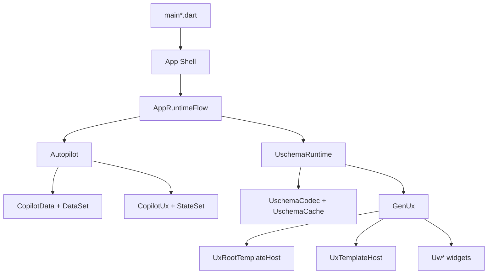

# GenRP — Deep Project Analysis

> **Project:** `genrp` — Generative Resource Planner  
> **Platform:** Flutter (macOS, Linux, Windows, Android, iOS)  
> **SDK:** Dart `>=3.11.3`  
> **Analysis Date:** 2026-03-26  

---

## 1. Executive Summary

GenRP is a Flutter monolith with four app shells sharing one `core` runtime:

| App | Role | Current posture |
|---|---|---|
| **AIWork** | Client/workflow CRUD surface | Spec-driven and runnable |
| **AIBook** | Client/runtime reader surface | Spec-driven and runnable |
| **AIStudio** | UX/spec authoring surface | Shared admin shell, partial restore |
| **AICodex** | Schema/data authoring surface | Shared admin shell, partial restore |

The current runtime direction is consistent:
- `Autopilot` is the central coordinator, split into `CopilotData` and `CopilotUx`.
- `AppRuntimeFlow` owns bootstrap and route switching.
- `UschemaRuntime` compiles and caches `UxSpec` trees on demand.
- `GenUx` renders compiled schema into `template/` and `uwidget/` primitives.
- `AIStudio` and `AICodex` share `AdminHome` instead of maintaining a second runtime stack.

This rerun also confirmed that the previous markdown snapshot had drifted:
- the current tree has no `lib/core/ux/paper/` directory;
- source and docs counts changed since the prior report;
- the analyzer is still clean, but there are still no checked-in Dart tests.

---

## 2. Current Architecture Snapshot

### 2.1 Runtime Path


```mermaid
graph TB
    MAIN["main*.dart"] --> APP["App Shell"]
    APP --> FLOW["AppRuntimeFlow"]
    FLOW --> AP["Autopilot"]
    FLOW --> RT["UschemaRuntime"]
    RT --> CODEC["UschemaCodec + UschemaCache"]
    AP --> DATA["CopilotData + DataSet"]
    AP --> UX["CopilotUx + StateSet"]
    RT --> GX["GenUx"]
    GX --> ROOT["UxRootTemplateHost"]
    GX --> TEMPLATE["UxTemplateHost"]
    GX --> UW["Uw* widgets"]
```

### 2.2 Active Directory Model

The repo currently resolves to this active UI/runtime shape:

```text
lib/
├── app/                 # App shells for aiwork, aibook, aistudio, aicodex
├── core/
│   ├── agent/           # Autopilot, CopilotData, CopilotUx, DataSet, StateSet
│   ├── base/            # X transport classes, converter, registries, bootstrap
│   ├── db/              # SQLite + DB contract/client scaffolding
│   ├── gen/             # AppRuntimeFlow, UschemaRuntime, GenUx, AdminHome
│   ├── model/           # BSchema, USchema, base, bdata
│   ├── theme/           # Shared Material theme helpers
│   └── ux/
│       ├── mixins.dart  # UxLayer, UxRegister, state access, host widgets
│       ├── template/    # Tworkspace, Tsheet, Treport, Tdboard, Twizard, Tform
│       └── uwidget/     # Shared widgets + specialized field widgets
└── main*.dart           # Dedicated entry points
```

Notably, `paper/` is no longer part of the checked-in runtime tree.

---

## 3. Current Metrics

These numbers were re-measured from the current working tree on 2026-03-26.

| Metric | Value |
|---|---|
| **Source files** (`lib/**/*.dart`) | 106 |
| **Source LOC** (`lib/**/*.dart`) | 13,373 |
| **Test files** (`test/**/*_test.dart`) | 0 |
| **Test LOC** | 0 |
| **Docs files** (`docs/**/*.md`) | 15 |
| **Root docs files** (`docs/*.md`) | 13 |
| **Asset JSON files** | 2 |
| **Analyzer status** | `flutter analyze` passed clean |
| **Test status** | `flutter test` reports no test files |

### Per-Directory Breakdown

| Directory | Files | LOC |
|---|---|---|
| `lib/app/` | 6 | 1,093 |
| `lib/core/agent/` | 6 | 558 |
| `lib/core/base/` | 7 | 728 |
| `lib/core/db/` | 8 | 889 |
| `lib/core/gen/` | 11 | 1,481 |
| `lib/core/model/` | 16 | 1,892 |
| `lib/core/theme/` | 1 | 297 |
| `lib/core/ux/` | 45 | 6,316 |
| `lib/` root entry files | 6 | 119 |

---

## 4. Subsystem Notes

### 4.1 `core/agent/`

- `autopilot.dart` is a thin `ChangeNotifier` coordinator.
- `copilot_data.dart` wraps `DataSet` and publishes data changes.
- `copilot_ux.dart` handles root-template, template, and uwidget scoping over `StateSet`.
- `state_set.dart` now stores four buckets: `chrome`, `app`, `node`, and `child`.

### 4.2 `core/gen/`

- `app_runtime_flow.dart` centralizes route bootstrap and `openRoute()` behavior.
- `uschema_runtime.dart` handles compile/cache refreshes around `UschemaCodec`.
- `genux.dart` is template-root focused: current rendering branches only on `UxLayer.template`.
- `adminhome.dart` remains the shared shell for AIStudio and AICodex.

### 4.3 `core/model/uschema/`

- `UxRouteHeaderSpec` remains the lightweight navigation token.
- `UxRouteSpec` wraps route metadata around a unified `UxSpec`.
- `UxSpec` and `UxWorkspaceMeta` carry most of the runtime shape used by `GenUx`.

### 4.4 `core/ux/`

- `mixins.dart` now holds the key runtime registry utilities and both host widgets.
- `UxRootTemplateHost` has explicit remount and dispose cleanup behavior.
- `UxTemplateHost` is still a lightweight mount-only host.
- `uwidget/uwfields/` remains the largest slice of the repo and the most behavior-dense UI area.

---

## 5. Findings From This Rerun

### 5.1 Template Child Cleanup Is Currently Broken

In `state_set.dart`, `clearTemplate()` removes the template node and then calls `_removeChildrenForZone(templateKey)`. The descendant check is:

```dart
if (k ~/ 10000 == zone) toRemove.add(k);
```

That arithmetic does not match the current `UxRegister` encoding:
- `templateCode = routeCode + templateId * 1000`
- `uwidgetCode = templateCode + uwidgetId`

So a child key differs from its parent template key by less than `1000`, while the current cleanup divides the child by `10000` and compares it against the full template key. In practice, `clearTemplate()` removes the parent `_node` entry but leaves `_child` descendants behind.

### 5.2 `UxTemplateHost` Does Not Tear Down Scoped State

`UxRootTemplateHost` has route-aware remount and dispose cleanup. `UxTemplateHost` only mounts once in `initState()` and has no matching `dispose()` or `didUpdateWidget()` path. That means nested or conditional template state can outlive the widget that created it until a full route clear happens.

### 5.3 Provider Bootstrap No Longer Matches Real Ownership

Each `main*.dart` still wraps the app in `ChangeNotifierProvider<Autopilot>`, but no widget currently reads that provider. `AIWork` and `AIBook` each create a second internal `Autopilot` inside their home state objects, while `AIStudio` and `AICodex` do not appear to consume an `Autopilot` at all. This is harmless at runtime today, but it makes the ownership model harder to reason about and can mislead future refactors.

### 5.4 Documentation Had Drifted From The Code

The prior deep-analysis markdown and README still described a `paper/` layer and outdated codebase counts. That mismatch is now corrected in this rerun.

---

## 6. Verification Snapshot

Commands run during this rerun:

```bash
flutter analyze
flutter test
```

Results:
- `flutter analyze` completed with `No issues found!`
- `flutter test` exited because the repo currently has no `test/` directory or `_test.dart` files

Manual smoke testing of the four entry points is still needed for behavioral confidence.

---

## 7. Recommended Next Steps

1. Fix `StateSet.clearTemplate()` descendant matching so child uwidget state is actually reclaimed.
2. Decide whether `UxTemplateHost` state is supposed to persist or be lifecycle-bound, then implement cleanup to match that rule.
3. Either remove the unused top-level `Autopilot` providers or refactor the apps to consume the provided instance consistently.
4. Add at least a small test surface around `UxRegister` key math, `StateSet` cleanup, and `AppRuntimeFlow`.
