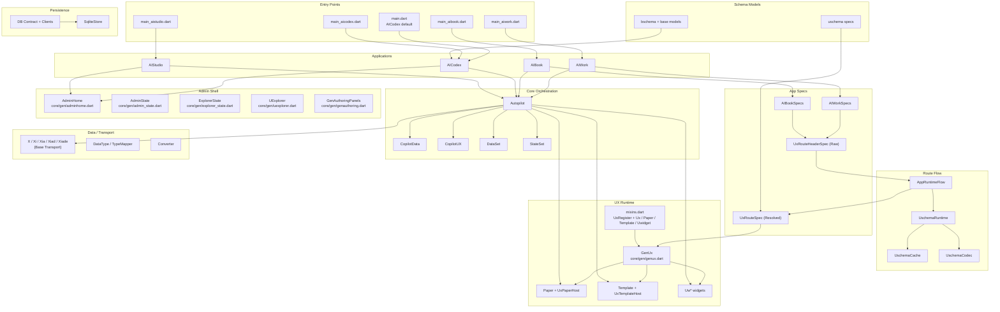
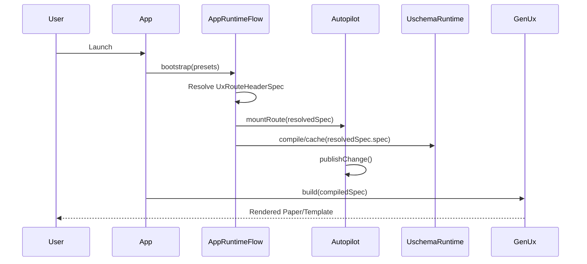

# GenRP — Deep Project Analysis

> **Project:** `genrp` — Generative Resource Planner  
> **Platform:** Flutter (macOS, Linux, Windows, Android, iOS)  
> **SDK:** Dart ≥3.11.0  
> **Analysis Date:** 2026-03-25  

---

## 1. Executive Summary

GenRP is a **Flutter monolith** containing **four distinct applications** inside a single codebase, unified by a shared `core` library:

| App | Role | Maturity |
|---|---|---|
| **AIWork** | Client/workflow CRUD surface | Ready to run from spec data |
| **AIBook** | Client/runtime reader surface | Ready to run from spec data |
| **AIStudio** | UX/spec authoring surface | Shared `AdminHome` shell, halfway restored |
| **AICodex** | Sensitive data-model authoring + schema-application surface | Shared `AdminHome` shell, halfway restored |

The apps share a common orchestration layer (`Autopilot`), route/spec metadata, shared UX primitives, and optional local DB scaffolding under `core/db`. `AIWork` and `AIBook` remain spec-driven through a schema-compiled runtime in `lib/core/gen/`, currently using local preset specs as the ready-state source. `AIStudio` and `AICodex` now use dedicated hard-coded authoring shells seeded from app-owned section data and shared `Uw*` components from `lib/core/ux/uwidget/`. 

The architecture has recently undergone a major decoupling phase:
- **Autopilot** is now a **thin coordinator**, delegating state and data to specialized copilots but owning the primary stores.
- **Navigation** is handled by a unified **AppRuntimeFlow** using schema-driven `UxRouteSpec` (resolved) and `UxRouteHeaderSpec` (raw).
- **The "Action Trio" architecture has been purged** in favor of direct state/data bindings and system-level functions, reducing runtime overhead and complexity.
- **A new UX Runtime layer** (`UschemaRuntime`) provides on-demand compilation and caching of UX specs.

### 1.1 Architecture Phase Change

GenRP has moved from an experimental "everything-is-an-action" model to a more robust **schema-first binding model**.

The current working tree is now highly consolidated:
- **Autopilot** is the single orchestration layer.
- **UschemaRuntime** + **GenUx** is the current spec-to-widget renderer for spec-driven apps.
- **core/ux** owns the shared UI contracts and primitives through `mixins.dart`, `paper/`, `template/`, and `uwidget/` (including 21 specialized field types).
- **AIWork** and **AIBook** stay on the spec-driven path.
- **AIStudio** and **AICodex** use dedicated hard-coded authoring shells, but they reuse the same shared UX primitives instead of introducing a competing runtime.

### 1.2 Dedicated Entry Points

GenRP supports dedicated entry points for each application, allowing for auto-sign-in and specific bootstrap configurations:
- `main_aicodex.dart`
- `main_aistudio.dart`
- `main_aibook.dart`
- `main_aiwork.dart`

By default, `main.dart` continues to boot **AICodex** for the current snapshot.

---

## 2. Architecture Overview


```mermaid
graph TB
    subgraph "Entry Points"
        MAIN["main.dart<br/>AICodex default"]
        MAINSTUDIO["main_aistudio.dart"]
        MAINCODEX["main_aicodex.dart"]
        MAINBOOK["main_aibook.dart"]
        MAINWORK["main_aiwork.dart"]
    end

    subgraph "Applications"
        AIWORK["AIWork"]
        AIBOOK["AIBook"]
        AICODEX["AICodex"]
        AISTUDIO["AIStudio"]
    end

    subgraph "Route Flow"
        ARF["AppRuntimeFlow"]
        UR["UschemaRuntime"]
        UC["UschemaCache"]
        UCO["UschemaCodec"]
    end

    subgraph "App Specs"
        WSP["AIWorkSpecs"]
        BSP["AIBookSpecs"]
        URS["UxRouteSpec (Resolved)"]
        URH["UxRouteHeaderSpec (Raw)"]
    end

    subgraph "Core Orchestration"
        AP["Autopilot"]
        CD["CopilotData"]
        CX["CopilotUX"]
        DS["DataSet"]
        SS["StateSet"]
    end

    subgraph "Admin Shell"
        AH["AdminHome<br/>core/gen/adminhome.dart"]
        AST["AdminState<br/>core/gen/admin_state.dart"]
        ES["ExplorerState<br/>core/gen/explorer_state.dart"]
        UE["UExplorer<br/>core/gen/uexplorer.dart"]
        GA["GenAuthoringPanels<br/>core/gen/genauthoring.dart"]
    end

    subgraph "UX Runtime"
        GX["GenUx<br/>core/gen/genux.dart"]
        PH["Paper + UxPaperHost"]
        TH["Template + UxTemplateHost"]
        VW["Uw* widgets"]
        REG["mixins.dart<br/>UxRegister + Ux / Paper / Template / Uwidget"]
    end

    subgraph "Schema Models"
        US["uschema specs"]
        BS["bschema + base models"]
    end

    subgraph "Data / Transport"
        X["X / Xi / Xia / Xiad / Xiade<br/>(Base Transport)"]
        DTP["DataType / TypeMapper"]
        CONV["Converter"]
    end

    subgraph "Persistence"
        SQL["SqliteStore"]
        DBC["DB Contract + Clients"]
    end

    MAIN --> AICODEX
    MAINSTUDIO --> AISTUDIO
    MAINCODEX --> AICODEX
    MAINBOOK --> AIBOOK
    MAINWORK --> AIWORK

    AIWORK --> WSP
    AIBOOK --> BSP
    AICODEX --> AH
    AISTUDIO --> AH

    WSP --> URH
    BSP --> URH

    URH --> ARF
    ARF --> URS
    ARF --> UR
    UR --> UC
    UR --> UCO

    URS --> GX
    GX --> PH
    GX --> TH
    GX --> VW
    REG --> GX

    AIWORK --> AP
    AIBOOK --> AP
    AICODEX --> AP
    AISTUDIO --> AP

    AP --> CD
    AP --> CX
    AP --> DS
    AP --> SS
    AP --> PH
    AP --> TH
    AP --> VW
    AP --> X

    US --> URS
    BS --> AICODEX

    DBC --> SQL
```

---

## 3. Codebase Statistics

| Metric | Value |
|---|---|
| **Source files** (`lib/`) | 112 Dart files |
| **Source LOC** (`lib/`) | ~13,779 lines |
| **Test files** (`test/`) | 0 Dart files in the current working tree |
| **Test LOC** (`test/`) | 0 |
| **Asset JSON files** | 2 files |
| **Asset data dir** | `assets/data/` (empty, reserved) |
| **Doc files** (`docs/`) | 20+ markdown files |
| **Dependencies** | flutter, cupertino_icons, path, path_provider, provider, sqflite, sqflite_common_ffi |
| **Analyzer status** | `flutter analyze` passes clean on 2026-03-25 |

### Per-Directory Breakdown (Approx.)

| Directory | Files | LOC |
|---|---|---|
| `lib/app/` | 6 | ~1,000 |
| `lib/core/agent/` | 6 | ~700 |
| `lib/core/base/` | 7 | ~800 |
| `lib/core/db/` | 8 | ~1,000 |
| `lib/core/gen/` | 11 | ~2,500 |
| `lib/core/model/` | 19 | ~2,500 |
| `lib/core/theme/` | 1 | ~300 |
| `lib/core/ux/` | 50 | ~5,000 |
| Root entry files | 4 | ~100 |

---

## 4. Directory Structure

```
genrp/
├── lib/
│   ├── main.dart                         # Default app entry (boots AICodex)
│   ├── main_aistudio.dart                # AIStudio dedicated entry
│   ├── main_aicodex.dart                 # AICodex dedicated entry
│   ├── main_aibook.dart                  # AIBook dedicated entry
│   ├── main_aiwork.dart                  # AIWork dedicated entry
│   ├── meta.dart                         # Static version flags
│   ├── app/                              # Application-specific MaterialApp shells
│   ├── core/
│   │   ├── agent/                        # Autopilot + Copilots + Store (StateSet/DataSet)
│   │   ├── base/                         # Transport (X), Converter, Bootstrap, TypeRegistry
│   │   ├── db/                           # persistence (SQLite, PostgreSQL scaffold)
│   │   ├── gen/                          # Runtime Flow, GenUx, Admin Shell, USchema Runtime
│   │   ├── model/                        # BSchema, USchema, Base, and BData models
│   │   ├── theme/                        # UxTheme (Material 3)
│   │   └── ux/                           # Primitives: Paper, Template, Uwidget, UwFields (21 types)
└── docs/                                 # Architecture, Handover, and User Guides
```

---

## 5. Core Subsystem Analysis

### 5.1 Orchestration Engine (`core/agent/`)

The **Autopilot** is the single orchestrator of the system. It has been refactored into a **thin coordinator** that maintains the global truth while delegating specific responsibilities to copilots:

| Component | Purpose |
|---|---|
| [autopilot.dart](lib/core/agent/autopilot.dart) | **Thin Coordinator**: Owns `DataSet`, `StateSet`, and `currentRoute`. Manages cross-cutting mounting and publishing. |
| [copilot_data.dart](lib/core/agent/copilot_data.dart) | **Data Copilot**: Manages remote/local business data synchronization. |
| [copilot_ux.dart](lib/core/agent/copilot_ux.dart) | **UX Copilot**: Manages transient UI state hierarchical scoping (Chrome/Paper/Template). |
| [data_set.dart](lib/core/agent/data_set.dart) | Slot-addressable key/value data store. |
| [state_set.dart](lib/core/agent/state_set.dart) | Scoped state container. |

**Key design decisions:**
- **Purge of Action Trio**: The experimental `ActionPerform`, `ActionCommand`, and `ActionListener` layers have been removed. System behavior is now driven by direct state manipulation via `Autopilot.state` and `Autopilot.data` or via system-level functions seeded in `core/base/sysfunc.dart`.
- **Decoupled Scoping**: `UxPaperHost` and `UxTemplateHost` manage the lifecycle of scoped state inside `Autopilot` automatically based on the current route.

### 5.2 Admin Shell + Gen/ (`core/gen/`)

The `core/gen/` directory has absorbed the runtime flow and schema-authoring logic:

| Component | Purpose |
|---|---|
| [app_runtime_flow.dart](lib/core/gen/app_runtime_flow.dart) | Centralizes `bootstrap()` and `openRoute()` logic for all apps. |
| [uschema_runtime.dart](lib/core/gen/uschema_runtime.dart) | Owns the `UschemaCache`, `UschemaCodec`, and `UschemaCompiled` instances. |
| [genux.dart](lib/core/gen/genux.dart) | Maps `UxSpec` (compiled) to concrete Flutter widgets. |
| [adminhome.dart](lib/core/gen/adminhome.dart) | The shared anchor for AIStudio and AICodex authoring. |

### 5.3 Transport Layer (`core/base/`)

The transport layer remains focused on the **`X` hierarchy**:
- `X` (v list) -> `Xi` (+i) -> `Xia` (+a) -> `Xiad` (+d) -> `Xiade` (+e).
- Slot-addressable binding (`v[slot]`) is the primary way UI fields connect to data.
- **TypeMapper** provides 53-bit safe integer mapping for cross-platform compatibility.

### 5.4 USchema Models (`core/model/uschema/`)

The UX specification model has been consolidated:
- [ux_spec.dart](lib/core/model/uschema/ux_spec.dart): Now contains the core `UxSpec`, `UxPaperSpec`, and `UxTemplateSpec` definitions.
- [ux_route_header_spec.dart](lib/core/model/uschema/ux_route_header_spec.dart): The raw, lightweight header for navigation.
- [ux_route_spec.dart](lib/core/model/uschema/ux_route_spec.dart): The fully resolved route spec used by `Autopilot`.

---

## 6. Data Flow Diagram (Updated)


```mermaid
sequenceDiagram
    participant User
    participant App
    participant Flow as AppRuntimeFlow
    participant Autopilot
    participant Runtime as UschemaRuntime
    participant GenUx

    User->>App: Launch
    App->>Flow: bootstrap(presets)
    Flow->>Flow: Resolve UxRouteHeaderSpec
    Flow->>Autopilot: mountRoute(resolvedSpec)
    Flow->>Runtime: compile/cache(resolvedSpec.spec)
    Autopilot->>Autopilot: publishChange()
    App->>GenUx: build(compiledSpec)
    GenUx-->>User: Rendered Paper/Template
```

---

## 7. Current Status & Gap Analysis

### What's Working ✅

- **Four Dedicated Entry Points**: `main_aiwork`, `main_aibook`, `main_aistudio`, `main_aicodex` all operational.
- **Clean Coordinator**: `Autopilot` is decoupled from routing and action-trio overhead.
- **Schema-Driven Rendering**: `AIWork` and `AIBook` operate entirely from local spec sets.
- **Converged Admin Shell**: `AIStudio` and `AICodex` share the `AdminHome` infrastructure.
- **21 Specialized UwField Types**: Robust input system with specific handlers for dates, colors, files, and links.
- **Clean Analyzer**: Codebase is lint-clean and architecture-consistent.

### Known Gaps ⚠️

- **Real Transport Integration**: `WebClient` exists but is not yet wired as the primary data source.
- **Auth Server Integration**: `mockauth.dart` is still the only active sign-in path.
- **Production Persistence**: SQLite is used for foundation but not yet as a full offline-first cache for business data.

---

## 8. Architectural Patterns

1. **Numeric Identity**: Everything (Type, Source, Widget, Slot) uses integer IDs for performance.
2. **Thin Coordinator**: `Autopilot` mediates but doesn't "know" the details of every sub-system.
3. **Drafting with i=0**: New records follow the `i=0` convention before server-side ID allocation.
4. **Paper/Template Scoping**: UX state is tiered to prevent collisions across different parts of the screen.

---

## 9. Test Strategy

Current verification relies on:
1. `flutter analyze` for type and consistency checks.
2. Manual application smoke-tests via dedicated entry points.
3. Planned: Unit tests for `UschemaCodec` and `AppRuntimeFlow`.

---

## 10. File Reference (Partial)

| Category | Key Files |
|---|---|
| **Entry** | `main.dart`, `main_*.dart` |
| **Agent** | `autopilot.dart`, `copilot_ux.dart`, `copilot_data.dart`, `state_set.dart` |
| **UX Primitives** | `lib/core/ux/uwidget/uwfield.dart`, `lib/core/ux/uwidget/uwfields/` (21 types) |
| **Runtime** | `lib/core/gen/app_runtime_flow.dart`, `lib/core/gen/uschema_runtime.dart`, `lib/core/gen/genux.dart` |
| **Models** | `lib/core/model/bschema/`, `lib/core/model/uschema/` |
